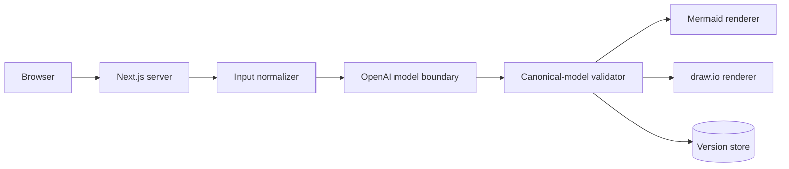
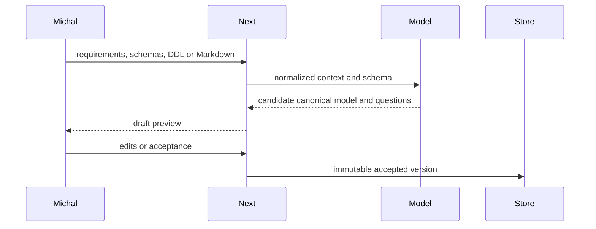

# Getting started with dev-stack

This guide takes a new user from an empty directory to an accepted feature scope and a
bounded build-test-verify loop. The worked example is a small data-modelling agent that
turns domain requirements into Mermaid ER diagrams and draw.io XML.

## What dev-stack is

dev-stack adds a project-local operating contract around a coding agent. It provides:

- a preserved project instruction entrypoint;
- explicit intent, boundaries and acceptance criteria;
- project-selected verification commands;
- source-bound review and evidence records;
- a bounded loop that routes product defects back to implementation and sends scope,
  test-oracle, authority and environment problems to the correct owner; and
- optional, disabled-by-default worker coordination.

It is not an application generator or an unattended deployment system. Installation
does not download dependencies, call a model provider, create a GitHub repository,
merge a PR, deploy code, or prove that the application works. Those remain explicit
project tasks and human approval gates.

The current private candidate targets Linux, Node 24.14+, Python 3.12+ and Git 2.43+.
Obtain an exact reviewed release directory through a trusted channel. The installer
captures and rechecks release identity internally between plan and apply. Ordinary users
do not need to read, copy or provide machine identifiers; distribution maintainers can
add stronger external pinning without changing this workflow.

## The files to know

For day-to-day use, start with **`AGENTS.md`**. It is the instruction entrypoint for the
human and coding agent. The installer owns only the marked dev-stack block; project rules
outside that block remain yours.

| File | Purpose | Normal owner |
| --- | --- | --- |
| `AGENTS.md` | Project instructions and link to dev-stack session policy. | Project, except the marked installer block. |
| `dev-stack.adapter.json` | Repository identity, branches, instruction paths, templates and verification commands used during install/upgrade. | Project. Keep it secret-free and version it. |
| `docs/features/<feature>/request.md` | Human-readable intent, boundaries, assumptions, exclusions and acceptance criteria. | Human and agent; versioned project history. |
| `docs/features/<feature>/design.md` | Accepted architecture, diagrams, decisions, risks and verification strategy for the matching request. | Human and agent; versioned project history. |
| `.governance-artifacts/<feature>.scope.json` | Generated source-bound contract derived from the accepted request/design pair. | Tool-generated; ignored by Git by default. |
| `.governance/delivery.json` | Installed delivery configuration generated from the adapter. | Installer; change the adapter and re-apply instead of hand-editing it. |
| `.governance/verification.json` | Installed allowlist of project verification commands. | Installer, generated from the adapter. |
| `.governance/policy.md` | Reusable always-on dev-stack policy. | Pinned dev-stack release. |
| `.governance/quality.md` | Reusable code-quality review conditions. | Pinned dev-stack release. |
| `.governance/principles.md` | Router for conditional engineering-principle skills. | Pinned dev-stack release. |
| `.governance/self-verification.json` | Maximum iterations, repeated failures and elapsed time for a loop. | Pinned dev-stack release. |

The request/design pair is the most important feature record: the request says what
“done” means, while the design says how the system will safely achieve it. A passing
command cannot silently replace an omitted criterion or change either accepted document.

## Worked example: build a data-modelling agent

The example assumes a GitHub repository named `YourOrg/data-model-agent` already exists.
It uses Node for the future application, but dev-stack itself does not choose the
application language, architecture or model provider.

### 1. Create the project repository

```sh
mkdir /work/data-model-agent
cd /work/data-model-agent
git init -b main
git remote add origin https://github.com/YourOrg/data-model-agent.git
```

The remote URL must match the repository declared in the adapter. Nothing is pushed by
these commands or by the installer.

### 2. Create the project adapter

Save the following as `/work/data-model-agent/dev-stack.adapter.json`. The two verification
commands name files the agent will create as part of the feature. Commands are argument
arrays, not shell strings; supported programs are `node`, `python3`, `git`, `pnpm`, `npm`,
`go` and `cargo`.

```json
{
  "delivery": {
    "schemaVersion": 1,
    "project": {
      "schemaVersion": 1,
      "repository": "YourOrg/data-model-agent",
      "branchPrefixes": ["feature", "fix", "chore"]
    },
    "baseBranch": "main",
    "queue": null,
    "instructionPaths": [
      "AGENTS.md",
      ".governance/policy.md",
      ".governance/quality.md",
      ".governance/principles.md"
    ],
    "templates": {
      "issue": ".governance/templates/issue.md",
      "pr": ".governance/templates/pr.md"
    }
  },
  "verification": {
    "schemaVersion": 1,
    "commands": {
      "unit": ["pnpm", "--dir", "apps/web", "test"],
      "build": ["pnpm", "--dir", "apps/web", "build"]
    }
  }
}
```

Do not put tokens, passwords, private prompts or provider credentials in an adapter.
Empty `commands` are allowed for installation but leave application verification
explicitly unconfigured.

### 3. Plan and install the release

Run the installer from the reviewed release directory:

```sh
RELEASE=/opt/reviewed/dev-stack-0.1.0-candidate.2
PROJECT=/work/data-model-agent
ADAPTER=/work/data-model-agent/dev-stack.adapter.json

python3 "$RELEASE/.governance/install.py" doctor --target "$PROJECT"
python3 "$RELEASE/.governance/install.py" plan \
  --target "$PROJECT" \
  --adapter "$ADAPTER"
```

`plan` prints only the release version plus readable create/update/remove actions. It
writes the detailed identities to an installer-managed local pending-plan file so the
user does not need to handle them. The artifacts directory is automatically ignored
once installed; do not add the first-install artifact to Git. Review the paths and
actions, then apply and verify:

```sh
python3 "$RELEASE/.governance/install.py" apply \
  --target "$PROJECT"

python3 "$RELEASE/.governance/install.py" verify --target "$PROJECT"
```

`apply` reloads the pending plan and refuses if the release, adapter, target state or
planned changes no longer match. A successful apply consumes the pending plan. To
upgrade, run `plan` from the new release's installer with the same adapter, then run its
`apply` and `verify` commands.

The install adds canonical governance files, native skill routers, `tools/governance`,
an ignored `.governance-artifacts/` area, and marked sections in `AGENTS.md` and
`.gitignore`. Existing content outside marked sections survives. Conflicting or locally
modified installer-owned files stop the operation for review.

Commit this governance baseline before feature work:

```sh
cd /work/data-model-agent
git add AGENTS.md .gitignore .agents .governance tools dev-stack.adapter.json
git commit -m "chore: install dev-stack governance"
git switch -c feature/data-model-agent
```

### 4. Ask for guided intake, one question at a time

Yes: dev-stack can conduct a one-question-at-a-time scope interview through the installed
session-initialisation skill. The CLI itself is intentionally non-interactive; the coding
agent asks the questions. In Codex, start with:

```text
Use $dev-stack-session-initialisation.

I want to build a data-modelling agent that turns domain requirements into Mermaid ER
diagrams and draw.io XML. Interview me one critical question at a time. Skip anything I
have already answered. Do not implement yet. First propose request revision 1 and ask me
to accept or revise it. Only after that gate, clarify the technical foundation one
critical question at a time, propose design revision 1 and ask me to accept or revise it.
```

For an agent host that does not support named skill invocation, use the equivalent:

```text
Read AGENTS.md and .governance/skills/session-initialisation/SKILL.md in full, then run
the same one-question-at-a-time intake. Do not implement until I separately accept the
request and design and then explicitly authorize implementation.
```

The agent should ask only unanswered questions that materially affect design or proof.
For this example, likely decisions are:

1. Who uses the tool and what decision should its output support?
2. What input is accepted: prose, structured JSON, an existing schema, or several forms?
3. What must Mermaid and draw.io represent: entities, attributes, keys, optionality,
   cardinality, notes, layout, or all of these?
4. When requirements are ambiguous, should the agent ask before producing a model,
   produce a draft then ask, or make labelled assumptions?
5. Is the interface a CLI, library, service or UI?
6. What sensitive data, tenancy, retention and network restrictions apply?
7. Which concrete examples and failure cases prove success?
8. What is explicitly excluded from the first feature?

This is a priority list, not a questionnaire to ask mechanically. The skill skips
answers already supplied and stops interviewing when a reviewable request is possible.
Architecture questions such as runtime, provider boundary, storage, component ownership,
failure handling and rollout follow only after the request gate.

### 5. Pass the request gate

Copy `.governance/templates/request.md` to
`docs/features/data-model-agent/request.md` and let the agent fill it from the guided
answers. It remains `status: proposed` while being reviewed. For this example the user is
Michal, the tool supports a large insurance organisation, inputs can be prose, schemas,
DDL or Markdown, and the first fixture is a claim-payment domain. A shortened revision
looks like this:

```markdown
---
kind: request
version: 1
revision: 1
status: proposed
slug: data-model-agent
---

# Data-modelling agent

## Intent

Give Michal a web UI that develops reviewable insurance data models from free-form
requirements, existing schemas, DDL and Markdown.

## Intent source

Direct user guided intake.

## Boundaries

- Single-user Next.js web application using an OpenAI model boundary.
- Produce, preview, edit, regenerate, save, retrieve and version Mermaid and draw.io models.

## Assumptions

- Pilot inputs may contain sensitive organisational information and may be persisted.

## Exclusions

- No multi-user authorization, deployment or automatic database migration in this pilot.

## Acceptance criteria

### MODEL-SEMANTICS

**Outcome:** A claim-payment fixture preserves entities, attributes, keys, optionality,
cardinality, business definitions and validation rules in one canonical model.

**Proof:** Compare the validated canonical result with literal expected domain facts.

### AMBIGUITY

**Outcome:** Ambiguous requirements produce a labelled draft and clarification questions
without silently inventing a relationship.

**Proof:** Exercise an ambiguous fixture and inspect the draft, warnings and absent edge.

### OUTPUTS

**Outcome:** The accepted canonical version produces equivalent Mermaid and importable
draw.io representations with a useful layout.

**Proof:** Inspect Mermaid semantics and parse draw.io XML for matching nodes and edges.

### WORKFLOW

**Outcome:** Michal can preview, edit, regenerate, save, retrieve, version and download a model.

**Proof:** Exercise the web workflow and verify stored version history and both downloads.

### PROJECT-CHECKS

**Outcome:** Configured unit and production-build checks pass on the exact candidate.

**Proof:** Run both commands from `.governance/verification.json`.

## Approval

Status: proposed. Awaiting an explicit human decision on request revision 1.
```

The concrete acceptance semantics matter more than wording. In particular, parse and
compare the two representations; file existence alone proves little. The human can ask
for edits. When satisfied, they say, for example:

```text
I accept request revision 1. Record that decision and commit the request. Do not design
or implement until the next gate.
```

Only then does the agent change the frontmatter and Approval text to `accepted` and
commit the request. No signature, digest or commit ID is requested from the human.

### 6. Establish and accept the design

After the request gate, the agent asks one unresolved architecture question at a time.
For this example, the important questions include the persistence technology, canonical
model schema, OpenAI structured-output boundary, editable representation, sensitive-data
handling, error recovery and rollout. It writes the result using
`.governance/templates/design.md` at `docs/features/data-model-agent/design.md`.

The accepted design must contain all template sections. A compact form of the chosen
approach could say that Next.js server routes validate uploads, a model service converts
them to a typed canonical model, deterministic renderers produce Mermaid and draw.io,
and a repository stores immutable model versions. Its diagrams use Mermaid:





The same document records decisions in a table rather than hiding them in prose:

| ID | Decision | Rationale | Alternatives | Consequences |
| --- | --- | --- | --- | --- |
| D-001 | Make a validated canonical model the source of both outputs. | It prevents two generators from drifting semantically. | Generate each format directly from the prompt. | Renderers require explicit mappings and tests. |
| D-002 | Keep model-provider access behind a server-only interface. | Inputs and credentials must not cross the browser boundary. | Call the provider from the browser. | Local development needs a server-side credential. |
| D-003 | Store immutable versions and make edits create a new version. | Review and rollback need history. | Overwrite the current record. | Storage grows and needs lifecycle handling. |

When the full design is reviewable, the human separately accepts it:

```text
I accept design revision 1 for request revision 1. Record that decision and commit the
design. Do not start implementation yet.
```

Only then does the agent mark and commit the design. A cross-feature decision can also
be promoted to the project's ADR convention, but its `D-NNN` row stays in the feature
design. Both documents must now be tracked and unchanged at `HEAD`.

### 7. Generate the private scope and baseline

Bind the accepted pair to the current checkout. The command checks both paths, statuses,
matching slug and request revision, then records the branch and commit internally:

```sh
tools/governance scope create \
  --request docs/features/data-model-agent/request.md \
  --design docs/features/data-model-agent/design.md \
  --output .governance-artifacts/data-model-agent.scope.json

tools/governance scope validate \
  --scope .governance-artifacts/data-model-agent.scope.json

tools/governance baseline \
  --scope .governance-artifacts/data-model-agent.scope.json \
  --project .governance/project.json

tools/governance config validate --config .governance/config.json
```

`baseline` exits 2 and reports `incomplete` by design. It records machine observations,
then requires lead review of authority, intent coverage, dirty-work ownership,
instructions and live dependencies. It is not a readiness oracle. A default config
reports workers as paused with effective capacity zero.

After reviewing the bound source and baseline, authorize implementation explicitly:

```text
Start implementation of the accepted data-model-agent request/design pair using
$dev-stack-self-verifying-delivery. Do not merge, deploy, configure a provider or
activate a worker. Stop for design review if a material gap is found.
```

### 8. Let the bounded loop run

The delivery skill coordinates the workflow; it does not replace engineering judgment:

```text
accepted request + accepted design + generated scope
  -> acceptance tests
  -> smallest complete implementation
  -> configured checks and direct artifact proof
  -> independent criterion and whole-intent verification
  -> classify the observation
       IMPLEMENTATION_DEFECT -> repair and verify a changed candidate
       SCOPE_GAP             -> stop for human design review
       TEST_ORACLE_INVALID   -> human acceptance review
       ENVIRONMENT_FAILED    -> repair the environment
       BLOCKED               -> human input or authority
       SCOPE_VERIFIED        -> final report
```

Each iteration is bound to the branch, commit and dirty-patch proof. The limits in
`.governance/self-verification.json` stop infinite repair. Tests may implement accepted
criteria, but the agent may not weaken criteria or tests merely to obtain green output.
Where possible, a different authorized agent/session or CI boundary performs the final
verification. If that is unavailable, the report must disclose the limitation and retain
human or CI review as the independent gate.

The final report should identify the candidate, show each criterion and its proof, list
commands run, describe limitations and residual risks, and name any remaining approval.
`SCOPE_VERIFIED` permits reporting only; it does not authorize merge or deployment.

If implementation exposes a material gap, stop rather than patching around it. Increment
and reaccept `design.md`; increment `request.md` only if intent, boundaries, assumptions,
exclusions or acceptance semantics change. Commit the accepted pair, generate a fresh
scope/baseline, and obtain implementation authority again.

## Starting any new feature or project request

For later work, use the same short sequence:

1. Create or select the approved worktree and a branch whose prefix appears in
   `.governance/project.json`.
2. Invoke `dev-stack-session-initialisation` and ask for guided intake if the request is
   not already precise.
3. Draft `docs/features/<slug>/request.md` with stable criterion IDs, observable outcomes,
   proof methods and boundaries; explicitly accept and commit it.
4. Clarify the technical foundation, draft the matching `design.md` with Mermaid diagrams
   and stable decisions, then explicitly accept and commit it as a separate gate.
5. Generate scope v2 from the accepted pair, run the baseline, and separately authorize
   implementation.
6. Invoke `dev-stack-self-verifying-delivery`.
7. Review the final source-bound report, then separately approve any PR, merge, release,
   deployment, provider or worker action.

If GitHub issue/PR actions will be used, start from the installed issue template and use
an `intentSource` such as `issue:42`. The reviewed `action plan`/`action apply` flow can
create or update supported repository records under explicit authority, but dev-stack has
no merge action. A direct-user source is sufficient for a local-only feature like the
example above.

## Adding project policy or quality rules

There are two different kinds of customization.

### Rules for one adopting project

Put concise, always-on project rules in root `AGENTS.md`, outside the
`dev-stack:begin`/`dev-stack:end` block. The installer preserves those bytes, and the
source-bound review treats root policy as a required condition.

For a larger project-owned policy:

1. create a user-owned file such as `docs/engineering-policy.md`;
2. link it from the user-owned part of `AGENTS.md`;
3. add its path to `instructionPaths` in `dev-stack.adapter.json`; and
4. run installer `plan`, review its paths/actions, `apply` the pending plan, and `verify`.

Configured instruction paths are included in review bundles and their bytes invalidate
stale repository-action plans. Do not hand-edit installed `delivery.json`: the next
upgrade will correctly stop on the local modification.

Project-specific quality expectations can be written as an explicit checklist in the
project-owned part of `AGENTS.md`. They are reviewed under the project-policy condition.
Use this route when the rule belongs to one product rather than every dev-stack adopter.

### Reusable rules for every dev-stack project

Change the dev-stack source and produce a new pinned release:

- add an always-on rule to `.governance/policy.md`;
- add a separately reported quality condition to the table in `.governance/quality.md`;
- add a conditional principle by creating
  `.governance/skills/principle-<name>/SKILL.md` and registering its trigger in
  `.governance/principles.md`.

Then update the review/test count invariants and `proof.json` where applicable, add any
new file to the sorted `release-inputs.json`, validate changed skills, run the full test
suites, rebuild `release.json`, and install/upgrade only through the reviewed new release.
Never edit an installed canonical file to disguise a project-only exception; local
modifications are deliberately preserved and block upgrades for review.

## Essential operational notes

- The adapter and governance files must not contain secrets.
- Verification commands are reviewed project code and may have side effects; listing a
  command does not authorize running it.
- Green commands prove command execution, not every criterion or the whole intent.
- Git commit, release, plan and evidence hashes remain in private artifacts and audit
  reports; people approve readable intent, criteria, paths, actions and authority.
- Worker support is optional and disabled by default. Model and provider choices are
  explicit local configuration, not bundled defaults.
- Do not run `tools/test-worker` casually. With an explicit worker configuration and
  credential it can make a provider call. Installation and normal local tests need no
  paid model call.
- Upgrade uses the same plan/review/apply/verify pattern. `recover`, `rollback` and
  `remove` preserve user-owned content and refuse uncertain state; see
  [operational recipes](recipes.md).
- Exact command schemas and exit meanings are in the [reference](reference.md); the
  architecture and trust boundaries are in [architecture](architecture.md); optional
  worker setup is in [workers](workers.md).
