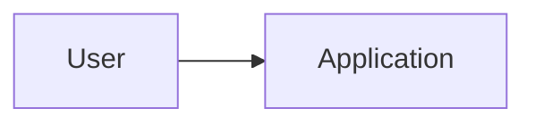
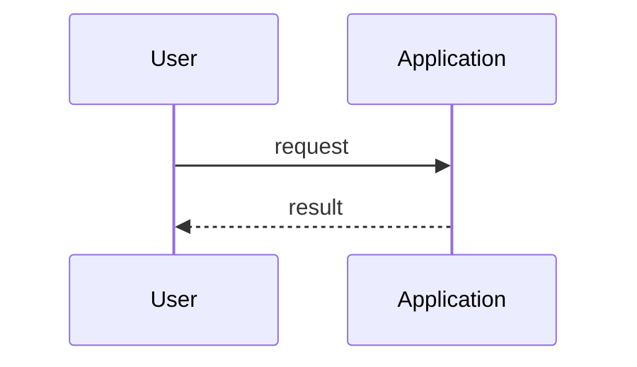

# Replace with feature name design

## Context

Describe the current system, constraints and architectural problem.

## Chosen approach

Describe the proposed technical shape and why it fits the accepted request.

## Alternatives considered

Describe credible alternatives and why they were not selected.

## Component diagram

## Data-flow diagram

## Domain model

Define the important concepts, invariants and ownership boundaries.

## Storage model

Define persisted data, lifecycle, versioning and migration behavior.

## External boundaries

Define validation, provider, network and file boundaries.

## Security and privacy

Define sensitive-data handling, authorization and retention expectations.

## Failure modes

Define expected failures, recovery and what must stop for human review.

## Verification strategy

Map the design to the accepted criteria and name meaningful architecture-level proof.

## Rollout and rollback

Define safe introduction, migration and reversal.

## Design decisions

| ID | Decision | Rationale | Alternatives | Consequences |
| --- | --- | --- | --- | --- |
| D-001 | Replace with one durable decision. | Explain why. | Name the credible alternative. | State the tradeoff. |

## Approval

Status: proposed. Replace this sentence after the human explicitly accepts this revision.
