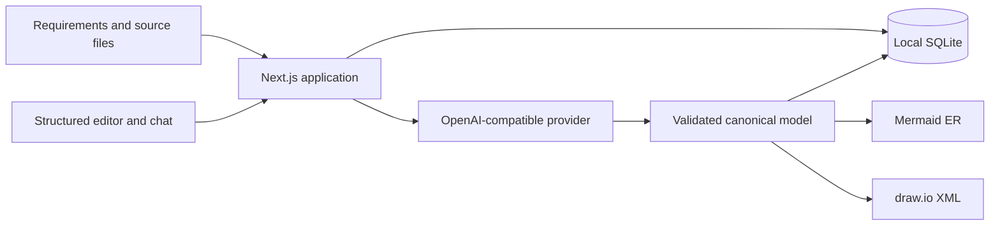

<div align="center">

# Data Model Agent

Turn requirements and existing schemas into reviewable, versioned data models with
consistent Mermaid and draw.io outputs.

[](https://github.com/MikeS071/data-model-agent/actions/workflows/ci.yml)
[](https://github.com/MikeS071/data-model-agent/releases/latest)
[](LICENSE)
[](https://nodejs.org/)
[](https://nextjs.org/)

[Getting started](#getting-started) · [Usage](#usage) · [Contributing](CONTRIBUTING.md) · [Security](SECURITY.md) · [Releases](https://github.com/MikeS071/data-model-agent/releases)

</div>

## Purpose

Data Model Agent is a local-first modelling workspace for turning incomplete business
requirements, schemas, DDL and documentation into one editable canonical data model.
It combines structured editing with an AI-assisted clarification workflow, then derives
Mermaid ER and draw.io representations from the same source of truth.

The included pilot is designed around claim-payment modelling for a large insurance
organisation. The modelling workflow is reusable, but the current application is a
single-user local pilot—not a production multi-user service.

## Highlights

- Start with free-form requirements and `.md`, `.txt`, `.sql`, `.ddl` or `.json` files.
- Save, reopen, edit or delete a model before making a provider request.
- Generate and refine a validated canonical model through an OpenAI-compatible Responses
  API.
- Work with a pannable, zoomable model canvas and the model assistant side by side.
- Answer one critical clarification question at a time; successful answers update the
  canonical model.
- Keep the original requirements editable as persistent model instructions.
- Edit entities, attributes, keys, references, cardinalities, rules and layout metadata in
  structured forms.
- Save immutable review versions and reopen any version as a new working draft.
- Preview and download equivalent Mermaid ER and draw.io representations.
- Keep long human, assistant and clarification messages readable with bounded scrolling.

## How it works



The browser never receives the provider credential. DDL and SQL inputs are treated as
inert text and are never executed. Provider responses are validated before they replace
the saved working draft.

## Technology

- Next.js 16 and React 19
- TypeScript
- Node.js built-in SQLite
- Mermaid
- OpenAI-compatible Responses API
- Vitest, Testing Library and Playwright
- dev-stack governance and self-verification records

## Getting started

### Prerequisites

- Node.js 20.9 or newer; Node.js 22 LTS is recommended.
- pnpm 10.32.1.
- An API key and model name for OpenAI or another compatible Responses API provider.
- Chrome for the end-to-end browser test.

### Installation

1. Clone the repository.

   ```sh
   git clone https://github.com/MikeS071/data-model-agent.git
   cd data-model-agent
   ```

2. Enable the package manager and install dependencies.

   ```sh
   corepack enable
   pnpm install --frozen-lockfile
   ```

3. Create the local environment file.

   ```sh
   cp apps/web/.env.example apps/web/.env.local
   ```

4. Set at least `OPENAI_API_KEY` and `OPENAI_MODEL` in
   `apps/web/.env.local`.

   ```dotenv
   OPENAI_API_KEY=your-provider-key
   OPENAI_BASE_URL=https://api.openai.com/v1
   OPENAI_MODEL=your-approved-model
   OPENAI_TIMEOUT_MS=120000
   OPENAI_REASONING_EFFORT=low
   OPENAI_MAX_OUTPUT_TOKENS=8000
   DATA_MODEL_DB_FILE=data-model-agent.db
   ```

5. Start the application.

   ```sh
   pnpm dev
   ```

6. Open [http://127.0.0.1:3000](http://127.0.0.1:3000).

`OPENAI_BASE_URL` and `OPENAI_MODEL` provide the initial settings. You can change both
from the application's **Settings** panel without restarting. The API key remains a
server-side environment variable and is never displayed or stored by the settings UI.

## Configuration

| Variable | Required | Default | Purpose |
| --- | --- | --- | --- |
| `OPENAI_API_KEY` | Yes | — | Server-side credential for the configured provider. |
| `OPENAI_BASE_URL` | No | `https://api.openai.com/v1` | Initial OpenAI-compatible API base URL. |
| `OPENAI_MODEL` | Yes | — | Initial provider model name. |
| `OPENAI_TIMEOUT_MS` | No | `120000` | Maximum duration of a generation or chat request. |
| `OPENAI_REASONING_EFFORT` | No | `low` | Reasoning effort sent to compatible providers. |
| `OPENAI_MAX_OUTPUT_TOKENS` | No | `8000` | Combined response budget for a provider request. |
| `DATA_MODEL_DB_FILE` | No | `data-model-agent.db` | SQLite filename under `apps/web/data/`. |

## Usage

1. Select **New model**, enter a model name and describe the domain in **Requirements**.
2. Attach any relevant Markdown, schema, SQL, DDL or JSON files.
3. Choose **Save model** to keep the intake without contacting the provider, or
   **Generate draft** to create the first canonical model.
4. Review the live Mermaid or draw.io view alongside the model assistant. Answer the
   displayed clarification question or request another change in chat.
5. Refine the persistent model instructions and structured model fields. Draft edits
   autosave locally.
6. Review assumptions, warnings and canonical JSON before selecting **Save version**.
7. Download Mermaid or draw.io from version history, or reopen a prior version as a new
   draft.

Generation and assistant messages send the current requirements, source context and model
to the configured provider. Use only information your organisation permits you to store
locally and transmit to that provider.

## Development and verification

```sh
pnpm test
pnpm --dir apps/web exec tsc --noEmit
pnpm build
pnpm test:e2e
```

Tests use deterministic provider substitutes and never make a live paid model call. The
GitHub Actions workflow runs the unit tests, TypeScript check and production build. Run
the Playwright workflow locally when changing interactive behavior.

The accepted request and design are retained in:

- [`docs/features/data-model-agent/request.md`](docs/features/data-model-agent/request.md)
- [`docs/features/data-model-agent/design.md`](docs/features/data-model-agent/design.md)

## Data, privacy and recovery

The pilot has no authentication and stores model content in an unencrypted local SQLite
database. It is suitable for controlled local evaluation, not production or shared use.

Stop the application before backing up or replacing the database. Copy
`apps/web/data/data-model-agent.db` and any matching `-wal` or `-shm` files together. The
entire `apps/web/data/` directory, local environment files and provider credentials are
excluded from Git.

Production adoption requires an explicit design covering authentication, authorization,
encryption, retention, provider governance, monitoring and deployment.

## Contributing

Contributions are welcome. Read [CONTRIBUTING.md](CONTRIBUTING.md) for the development
workflow and pull-request checklist. Use
[GitHub Issues](https://github.com/MikeS071/data-model-agent/issues) for reproducible bugs
and focused feature proposals.

## Security

Do not report vulnerabilities in public issues. Follow the private reporting process in
[SECURITY.md](SECURITY.md), and never include provider keys, proprietary schemas or live
organisational data in a report.

## License

Distributed under the MIT License. See [LICENSE](LICENSE) for the complete terms.

## Acknowledgements

- README structure inspired by the
  [Best README Template](https://github.com/othneildrew/Best-README-Template).
- Project governance is based on
  [dev-stack](https://github.com/EtnaJamesCapital/dev-stack).
