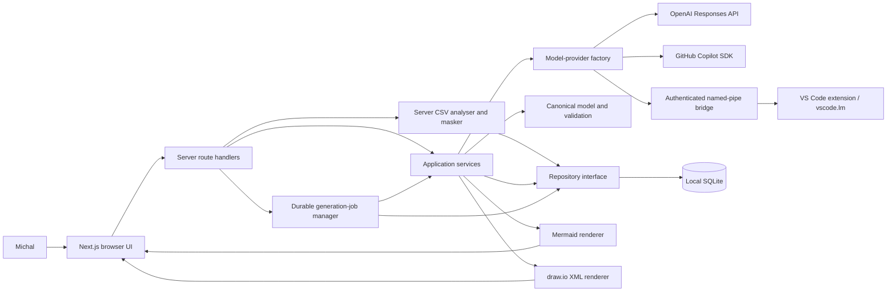

# Data-modelling agent design

## Context

Michal needs a single-user pilot for developing insurance data models from free-form
requirements and text-based technical artifacts. The application must turn uncertain
inputs into an explicit draft, preserve and edit the supplied sources, provide structured
editing, and keep Mermaid and draw.io outputs semantically aligned. CSV data extracts may
contain useful structural evidence and sensitive row values. The application must retain
the original locally while sending only a confirmed, bounded and explicitly reviewed
representation to the selected provider. The pilot may handle sensitive organisational information and
persists its state locally. Long provider calls must remain observable and recoverable.
It is not a production, multi-user or deployed service.

## Chosen approach

Build one TypeScript Next.js application using the App Router and the Node.js runtime.
Keep browser components concerned with intake, structured model editing and previews;
route handlers call application services through server-only boundaries.

The domain layer owns a validated canonical model. An input normalizer treats prose,
Markdown, DDL, SQL, JSON and schema files as inert text. CSV follows a separate
server-authoritative analysis boundary before it can enter a generation context. A
replaceable model-provider interface selects an OpenAI Responses API adapter, GitHub
Copilot SDK adapter or VS Code language-model bridge adapter; deterministic fakes remain
available in tests. The provider is asked for structured JSON and the application
validates the complete response again before it can become a working draft.
`OPENAI_API_KEY` remains a server environment secret. The Settings view chooses a global
default provider and model. Each project stores its own non-secret provider/model
selection, initialized from that default, so existing projects do not silently change
destination when the global default changes.

Add `csv` to `SourceKind`, but keep the original CSV content local and distinct from its
provider-safe analysis. A server-only CSV analyser uses the maintained `csv-parse`
library in strict record-width mode. It accepts UTF-8 with an optional byte-order mark,
RFC-style quoted fields, escaped quotes, embedded commas and embedded line breaks.
Non-CSV source kinds retain a 1 MB per-file limit. CSV uses a dedicated 10 MB per-file
limit, and normalized content across every attachment is capped at 50 MB. Parser-time row
and column ceilings bound CSV work before profiling even when the byte limit permits a
larger extract.

Attaching or editing a CSV calls an analysis route that persists only masking-session
state and shows a review card in the
requirements/source panel. The analyser proposes whether the first record is a header and
returns editable column names, row/column counts, inferred types, nullability and format
evidence. The user confirms or corrects the header interpretation. Confirmation binds the
canonical analysis to a SHA-256 digest of normalized source content plus an analysis
version. Any content or header change invalidates confirmation and blocks generation and
chat until server analysis is recomputed and confirmed.

CSV analysis also needs a stable masking scope before a project exists. When the first CSV
is attached to an unsaved intake, the server creates an expiring `CsvIntakeSession` with a
random opaque ID and server-only masking key; it stores no raw CSV. Subsequent analysis
requests present that ID and receive samples using the same key for any user-marked
sensitive columns. Project creation
atomically transfers the key and key generation into the new project, recomputes each CSV
from submitted content and persists the confirmed analyses. Existing projects analyse
against their project key directly. This guarantees that the preview pseudonyms are
identical to saved and provider pseudonyms without using a global key or exposing key
material. Abandoned intake sessions expire after 24 hours and are deleted opportunistically.

The analyser parses the complete bounded file locally but emits at most 100 sampled data
rows. Sampling is deterministic and distributed across the complete row range using
evenly spaced indexes, with duplicate indexes removed for small files. Profiles use the
complete parsed file for type candidates, null ratio, length bounds, uniqueness ratio and
recognized formats, but do not expose raw string extrema or value lists.

There is no automatic sensitivity classification. Every sampled value is displayed and
sent unchanged by default. The review UI lets the user explicitly mark any column
sensitive before confirmation and clearly states that unmarked sampled values will be
sent to the selected provider. Values in marked columns become stable project-scoped
pseudonyms generated by HMAC with a server-only random project masking key. Matching
marked values therefore remain linkable across that project's CSV files without revealing
their raw values. Type and format evidence is carried separately.

Project creation/update recomputes or verifies every submitted CSV analysis on the server
before committing source and confirmation state. Durable generation jobs snapshot the
confirmed provider-safe CSV context, its content digest and analysis version, never the
raw CSV. Chat uses the same confirmed context builder. Textual source kinds retain their
current bounded normalized content behavior.

Reloading while a queued/running job exists resumes observation of that immutable job.
The Retry action for a failed/interrupted job does not replay its old request JSON: it
first runs the same preflight as Generate/Regenerate—persist the current draft,
requirements, sources, provider and model; recompute/validate CSV confirmation; then
atomically create a new job from those current inputs and record `retry_of_job_id` for
audit. If a CSV has changed or become unconfirmed, Retry is disabled until review is
complete and is labelled `Retry with current inputs`. Other unsaved valid edits are
flushed before job creation. Historical job snapshots remain readable evidence but cannot
be applied as new work.

The VS Code adapter uses a companion extension and only the public `vscode.lm` API. The
extension writes a user-local connection record containing a random named-pipe address
and 256-bit bearer token, accepts bounded versioned protocol messages, requires an
explicit user-initiated app request, exposes no tools, rejects permission requests and
never extracts or forwards provider credentials. The server verifies the protocol and
token, requests the selected model, and maps quota, timeout and unavailable-runtime
failures into typed application errors. The GitHub Copilot SDK adapter remains an
alternative when its supported runtime can execute.

Generation runs through SQLite-backed jobs rather than the lifetime of one browser
request. A job snapshots the requirements, source documents, current model and selected
provider/model; progresses through queued, running, receiving and validating phases;
records a bounded transcript and three-second heartbeat; and finishes as completed,
failed, cancelled or interrupted. The browser starts a job and polls its durable state.
Reloading resumes that view. Process restart and stale heartbeat recovery mark unfinished
work interrupted and offer an explicit retry. Partial provider output is activity only:
one atomic save replaces the working draft after complete schema and domain validation.

Use Node's SQLite support behind a repository interface. One mutable working draft is
autosaved transactionally. An explicit Save Version action creates an immutable snapshot
of the request sources, canonical model and generated representations. Deterministic,
pure renderers derive Mermaid ER and draw.io XML from the same canonical model. The UI
provides structured entity, attribute, rule and relationship forms; canonical JSON is
read-only diagnostic output. Mermaid and draw.io previews are read-only, while downloads
contain the generated source formats.

A model project exists independently of provider generation. Michal can save, reopen and
edit its name, requirements and source artifacts before any draft exists, then generate
when the intake is ready. Deleting a project is an explicit confirmed action that removes
the project and its cascading source, working-draft and version records; cancellation
must leave all records unchanged.

The original requirements remain visible and editable after generation as the project's
Persistent model instructions. They are the durable modelling brief rather than a
one-time prompt: generation and every chat revision use the latest saved value. The
working-draft form offers an explicit save action, reports whether edits are saved, and
flushes unsaved instruction edits before Regenerate or Send message so a provider request
cannot use stale requirements. Updating these instructions does not itself call the
provider or rewrite the canonical model.

After a working draft exists, a project-scoped chat opens from the fixed lower-left bubble
over the live model workbench. Each user message is sent with the current canonical model,
the next unresolved clarification when one exists, and bounded recent conversation context.
Clarifications are ordinary guided chat turns rather than a separate form: answering the
question asks the provider to update the model and advance or clear the clarification
queue. The provider returns both a concise assistant reply and a complete proposed
canonical draft under structured output; local validation must pass before the draft and
both chat messages are saved together. The structured editor remains the authoritative,
directly editable view below the live model output, so conversational changes are
immediately visible in the model output and editor.

Use the project-local UI/UX Pro Max output in
`design-system/data-model-agent/MASTER.md` as the visual interaction contract. Present the
application as a calm, data-dense enterprise workbench rather than a marketing page. A
compact product header exposes local-pilot and save state. Its Model Foundry brand returns
to the home intake and is labelled as the Data Model Design Space. Desktop gives the live
model output the top workbench area, followed by the full-width
structured editor and history; assumptions and warnings form the final review section.
Project chat is a viewport-fixed lower-left bubble that opens a bounded panel above itself
without moving the workbench. Smaller screens retain the same content order without
horizontal page scroll.
The saved-model workspace is a keyboard-operable collapsible sidebar: collapsing it leaves
an icon rail and gives the workbench and live output the recovered width. Settings is a
first-class sidebar destination rather than a hidden environment-only task.
Entity details use accessible progressive
disclosure so a large model remains scannable. Every entity, the relationships editor,
validation rules and version history are collapsed initially and use native summaries
that retain their names and item counts. Semantic colors, persistent labels,
native controls, visible focus, live status and reduced-motion behavior are required.
All buttons share one font family, weight, sizing rhythm, radius and focus treatment;
semantic variants change color without changing their typographic character. Both model
representations use one interactive canvas: a mouse wheel zooms around the pointer,
primary mouse-button dragging pans the model, and visible zoom/reset controls plus
focusable arrow and zoom keys provide non-drag alternatives. Switching representation
resets the viewport so an off-screen pan cannot make the next model appear empty.
The canvas defaults and resets to 50% scale, can zoom out further for large models, and is
taller on desktop. Chat messages must shrink within their panel and wrap long tokens rather
than expanding the collaboration grid or creating horizontal overflow. The complete
persisted transcript remains available in one bounded, vertically scrollable region. An
message from either the human or assistant, including clarification questions and answers,
expands to a full ten-rendered-line reading surface before its own body scrolls, so a long
turn cannot push the composer out of reach and no conversation text is discarded.
Transcript rows retain their content height instead of shrinking to fit the viewport; once
their combined height exceeds the bounded message area, that area scrolls independently
and the newest turn is brought into view. Scrolling a long message body can hand off to
transcript scrolling at its boundary rather than trapping the wheel.

The Model representations title sits above one horizontally scrollable toolbar containing
status, Mermaid/draw.io selection, zoom/reset, Copy, Export PDF, Regenerate, Save version
and Delete. The canvas follows immediately with no explanatory copy. Copy and Export PDF
always use a dedicated off-screen rendering of the Mermaid source, never the draw.io
preview or its layout, regardless of the selected preview tab. Mermaid renders native SVG
text rather than XHTML `foreignObject` labels so clipboard/PDF rasterization cannot taint
the canvas. PDF export adds the Mermaid image and paginated descriptions of every entity,
attribute, relationship, validation rule, assumption and warning. Entities, assumptions
and warnings use native disclosures and are collapsed initially.

Sending a chat message creates a transient user bubble immediately and clears the
composer for the next thought. A separate assistant bubble with an atomic polite
`Thinking...` status remains visible for the lifetime of the provider request. One model
mutation is allowed in flight to prevent stale responses from overwriting the canonical
draft, but the transcript, composer and rest of the page remain usable. Success replaces
the transient turn with the atomically persisted user and assistant messages. Failure
removes the transient status, restores the sent text when the composer is still empty,
and leaves the persisted transcript and canonical model unchanged.
The thinking bubble uses a restrained surface pulse and animated activity dots to show
continued work during slow requests. Motion uses opacity and transforms only; under
`prefers-reduced-motion: reduce`, the animation stops while the visible and announced
status remains.

## Alternatives considered

Generating Mermaid and draw.io independently from the model response was rejected because
the representations could disagree. Calling OpenAI from the browser was rejected because
it would expose credentials and weaken input control. A hosted database was rejected as
unnecessary for a local single-user pilot. Overwriting saved models was rejected because
it destroys review history. A raw JSON editor and an embedded draw.io editor were rejected
because structured domain editing gives one source of truth with a smaller pilot surface.
Sending complete CSV files to the provider was rejected because row-level data is
unnecessary for most structural inference and materially increases privacy and token
exposure. Browser-authoritative parsing was rejected because API callers could bypass it
and a saved confirmation could diverge from the server's generation input. Headers-only
context was rejected because bounded values and profiles improve type, format, optionality
and relationship inference. Random per-file masking was rejected because it destroys
useful equality evidence across related extracts.

## Component diagram



## Data-flow diagram

```mermaid
sequenceDiagram
  actor Michal
  participant UI as Browser UI
  participant App as Next.js server
  participant CSV as CSV analyser
  participant Job as Durable generation job
  participant AI as Project-selected provider
  participant Domain as Domain validator
  participant DB as SQLite repository
  Michal->>UI: Attach CSV and edit requirements/sources
  UI->>App: Analyse CSV bytes
  App->>DB: Create/reuse expiring intake masking session
  App->>CSV: Parse, infer headers, profile, sample and mask
  CSV-->>UI: Reviewable candidate analysis
  Michal->>UI: Confirm or correct inferred headers
  UI->>App: Save source and confirmation
  App->>CSV: Recompute with intake/project key and verify digest
  CSV->>DB: Transfer key; persist source and confirmed analysis
  Michal->>UI: Select provider/model and start generation
  UI->>App: Save inputs and start generation
  App->>DB: Persist provider-safe immutable job snapshot
  App-->>UI: 202 Accepted with job ID
  App->>Job: Run queued job
  Job->>AI: Requirements, safe source contexts and JSON schema
  AI-->>Job: Progress and structured-output fragments
  Job->>DB: Heartbeat, phase and bounded transcript
  UI->>App: Poll job after reload or navigation
  App-->>UI: Current durable activity
  AI-->>Job: Complete structured candidate
  Job->>Domain: Parse and validate complete candidate
  Domain-->>Job: Valid draft or typed validation failure
  Job->>DB: Atomically save draft and complete job
  App-->>UI: Draft, assumptions, warnings and next question
  Michal->>UI: Answer clarification or request a change in chat
  UI->>App: Message plus current project context
  App->>AI: Current canonical model, next question and bounded chat context
  AI-->>App: Assistant reply plus complete revised draft
  App->>Domain: Validate revised canonical model
  App->>DB: Atomically save chat turn and working draft
  App-->>UI: Updated model beside assistant reply
  Michal->>UI: Edit structured model below live output
  UI->>App: Autosave edited draft
  Michal->>UI: Save Version
  App->>DB: Commit immutable snapshot
  App-->>UI: Mermaid/draw.io previews, Mermaid image copy and PDF
```

## Domain model

`ModelProject` owns a title, timestamps, ordered `SourceArtifact` records, one
`WorkingDraft` and immutable `ModelVersion` records. A source artifact records its
original name, accepted text type, content and content length. A working draft records
the current canonical model, assumptions, warnings, clarification queue and generation
metadata. A version snapshots those values plus Mermaid and draw.io output.

A CSV `SourceArtifact` owns at most one `CsvAnalysis`. The analysis records the normalized
content digest, analysis version, inferred and confirmed header modes, confirmed column
names, row/column counts, column profiles, reviewed distributed sample, confirmation state
and timestamp plus the masking-key generation ID. A `CsvColumnProfile` records ordinal,
confirmed name, type candidates, null/unique ratios, length bounds, recognized formats
and sensitivity categories without raw value extrema. A `CsvSampleRow` records the
original zero-based data-row index and provider-safe cell values. Confirmation is valid
only while source digest, header choices, analysis version and masking-key generation
match.

Each project owns a random masking key and non-secret generation ID created on the server.
The key never enters browser DTOs, logs, job snapshots or provider requests. It exists
only to create stable project-scoped pseudonyms; deleting the project deletes the key and
prevents future cross-file linkage. A `CsvIntakeSession` provides the same key/generation
before project creation, expires after 24 hours, stores no source content and can be
consumed exactly once by project creation.

`CanonicalModel` contains stable model, entity, attribute, relationship and rule IDs.
Entities contain names, business definitions, layout positions and attributes. Attributes
contain data type, optionality, primary-key and foreign-key metadata and business
definitions. Relationships reference existing entity IDs and express cardinality at both
ends. Validation rules have stable IDs, readable expressions and referenced domain IDs.

All relationship endpoints and referenced attributes must exist; names are unique within
their owner; keys cannot reference missing attributes; cardinality uses the supported
one/zero-or-one/many forms; and layout coordinates are finite. The Claim-Payment fixture
adds the explicit rule that total paid cannot exceed the approved claim amount. Ambiguous
facts remain assumptions, warnings or clarification items rather than invented domain
edges.

## Storage model

Use a project-local SQLite file excluded from Git. Versioned SQL migrations create
projects, source artifacts, working drafts, model messages, model versions, provider
settings, application defaults, project-provider selections and generation jobs.
Canonical models, clarification state and generated representations are stored as
validated JSON or text;
timestamps and version numbers are ordinary indexed columns. Foreign keys enforce project
ownership, and `(project_id, version_number)` is unique.

An additive migration creates `csv_intake_sessions`, `project_csv_masking_keys` keyed by
project and `csv_source_analyses` keyed by source artifact. Intake sessions store opaque
ID, key bytes, generation ID and expiry only. Project masking keys store key bytes,
generation ID and timestamps as restricted local data. CSV analysis stores source digest,
analysis version, masking generation, confirmation fields, profiles and reviewed sample as
validated columns/JSON. It cascades with the source and project. Source replacement and
analysis confirmation commit in one transaction so a confirmation cannot point at older
content.

Creating a project from an intake session uses `BEGIN IMMEDIATE`: validate session/expiry,
insert the project, transfer key bytes and generation ID, recompute and insert sources/
analyses, then delete the session. Rotation creates a new key and generation ID and marks
all project CSV analyses unconfirmed in the same transaction. A missing key is a typed
blocking state when CSV analysis state already exists; it never causes silent key
regeneration while confirmations exist. For a migrated/existing project with no masking
key and no CSV analysis rows, attaching its first CSV transactionally creates the initial
project key/generation before analysis. This one-time lazy initialization is distinct
from recovery after key loss.

Autosave upserts the single working draft in one transaction without creating history.
Save Version reads the working draft, validates it, renders both formats and inserts one
immutable version plus its source snapshot in one transaction. Reopening an old version
does not mutate it; choosing to continue from it copies its canonical model into the
working draft. Repository interfaces keep SQLite details out of domain and UI code.
Project chat messages use ordered user/assistant roles and cascade with project deletion.
A successful chat turn writes its two messages and revised working draft in one
transaction; provider or validation failure writes neither.

Provider settings store only normalized non-secret base URLs, provider types, model names
and update timestamps. Environment values supply initial fallbacks until the user saves a
default. A project-provider row snapshots that project's selection independently of the
global default. API keys and VS Code bridge tokens are never part of those rows. Updating
settings is an idempotent upsert and does not modify drafts, messages or versions.

Each `generation_jobs` row owns a project, provider/model and request snapshot, status,
phase, message, bounded transcript, typed error and lifecycle timestamps including the
latest heartbeat. Creating a job is rejected while that project has queued or running
work. Completion validates and saves the draft before marking the job complete.
Cancellation and interruption never apply partial transcript output to the canonical
model. Job request JSON stores prebuilt provider-safe source contexts; CSV entries contain
only digest/version/key generation, confirmed columns, profiles and reviewed sample.
Resuming an existing active job therefore observes its exact reviewed snapshot without
reading newer sources. A new retry job is linked through nullable `retry_of_job_id` but
snapshots the current confirmed contexts; it never replays the older job request or
persists raw CSV in either job row.

## External boundaries

Accept manually entered text plus `.md`, `.txt`, `.sql`, `.ddl`, `.json` and `.csv` files.
Treat every upload as inert data, enforce per-file and aggregate size limits, normalize
line endings, and reject binaries or malformed encodings. Never execute supplied DDL,
HTML, scripts or spreadsheet formulas.

The shared source normalizer selects its per-file byte limit from source kind: 1,000,000
bytes for text/Markdown/SQL/DDL/JSON and 10,000,000 bytes for CSV. It sums normalized
UTF-8 bytes for all sources and rejects totals above 50,000,000 bytes. The multipart CSV
analysis boundary enforces the same 10,000,000-byte CSV limit before decoding; the parser
record-size ceiling uses that value while `on_record` still aborts excessive rows,
columns or inconsistent widths during parsing.

The browser sends CSV bytes to `POST /api/csv-analysis` as multipart data rather than
decoding them with `File.text()`. The server performs fatal UTF-8 decoding, strips an
optional BOM, parses with explicit comma delimiter and strict column counts, applies row/
column ceilings, profiles and masks, and returns a bounded review DTO. The route stores
no CSV content or analysis; before project creation it persists only the expiring intake
session key/generation record. Project create/update accepts the original normalized CSV,
intake-session ID when applicable, and a confirmation claim; it recomputes the canonical
analysis and rejects mismatched digest, analysis version, key generation or header
choices. This makes preview and persistence use one authority.

Clicking Generate first persists the editable intake and creates a job from that exact
snapshot. The job invokes the selected server-only adapter with a JSON Schema
structured-output contract, configured model, bounded timeout and no application tools.
OpenAI base URLs must use HTTP or HTTPS, contain no embedded credentials and remain
length bounded. Provider runtime limits are server-only environment values and invalid
settings fail closed before a request. The application does not rely on provider output
being valid: it parses and validates the complete response locally before persistence.
Tests replace adapters and never make an external network call.

The VS Code bridge is local IPC, not an HTTP listener. Its user-only connection record
contains a random pipe name and bearer token and is replaced safely as VS Code windows
activate or close. Protocol frames are versioned, authenticated and size bounded. Model
discovery and generation are the only supported operations. The bridge does not expose
GitHub/Azure sign-in state, OAuth tokens, VS Code commands, tools or filesystem access.

Chat uses a separate structured-output contract over the same provider boundary. It sends
the current requirements, canonical model, bounded source context, next unresolved
clarification, a bounded recent chat history and the new message. When the message answers
that clarification, the complete result must apply the answer to the model and advance or
clear the clarification queue. A chat response must contain a non-empty assistant reply
and a complete generation result; partial patches are not applied to the canonical model.
The context builder formats confirmed CSV input as explicit metadata, columns, profiles
and numbered reviewed sample rows. Values are unchanged unless the user marked their
column sensitive. It never passes complete raw CSV content to a provider adapter.

SQLite is reachable only through the repository interface. Renderers are pure functions
over a validated canonical model. Download endpoints derive safe filenames, set explicit content types and return only the
requested representation. Browser Copy and Export PDF render from the same generated
Mermaid source used by the Mermaid preview; the draw.io preview is never an export source.

## Security and privacy

The pilot has no authentication and therefore binds to the local development host by
default; it must not be exposed as a shared network service. The UI clearly states that
Generate and chat send the supplied material to the project-selected provider. OpenAI
API keys remain server environment variables. GitHub/Azure credentials remain owned by
VS Code. Neither is persisted, serialized into page props or included in browser bundles.
Non-secret provider/model selections are visible and editable; changing them affects only
the next provider request and never migrates or retransmits stored model data by itself.

Raw CSV remains sensitive local source material subject to the same filesystem and backup
controls as requirements. It is never written to logs, transcripts, provider diagnostics
or generation-job snapshots. The server-only project masking key must not be serialized,
returned from APIs or exported with model versions. Analyses and confirmations bind to
the non-secret key generation ID; rotation or missing key material transactionally
invalidates all project CSV confirmations before any new context can be built. HMAC tokens are scoped to one project, so equality for user-marked values is visible only
within that project's provider context and tokens cannot be correlated across projects.
The review UI displays exactly the provider-bound sample and profiles, marks no columns
sensitive automatically, provides a control for each column and warns that unmarked
sampled values will be sent unchanged.

Logs contain request IDs, durations and typed error categories, not source content,
prompts, provider responses or secrets. Provider diagnostics record the configured model
and non-sensitive runtime settings so a timeout, rate limit, provider rejection or
incomplete capped response remains distinguishable. UI rendering escapes user-controlled
text, and generated XML uses an XML-safe encoder. SQLite and local source records are not
encrypted at rest in this pilot; filesystem access and backup protection remain host responsibilities.
Chat content is subject to the same local-storage and provider-transmission disclosure as
requirements and source files. User messages are length-bounded server-side, rendered as
text, and never interpolated into executable code.
Production use requires a new request/design covering authentication, authorization,
retention, encryption, approved provider settings and organisational data controls.

## Failure modes

Unsupported or oversized input is rejected before storage or provider access with a
specific correction message. Missing provider configuration disables live Generate while
leaving saved models usable. Provider timeout, quota/rate limit or unavailable-runtime responses retain the current
working draft and offer an explicit retry without creating a version. A response stopped
by the configured output-token cap is reported as incomplete. Job progress, transcript
and heartbeats make long calls observable; stale or restart-orphaned jobs become
interrupted rather than appearing to run forever.
An invalid provider base URL or blank model is rejected inline without changing the saved
settings. A configured endpoint that does not support the expected Responses API fails as
a typed provider error while saved work remains available. The same typed provider
failures apply to chat. A failed, incomplete or invalid chat
response leaves both the current draft and transcript unchanged, making retry explicit.
The optimistic user bubble and thinking indicator are presentation-only and are removed
on failure; the submitted text is restored to the composer when that does not overwrite a
newer draft message. Mermaid render failure keeps Copy and Export PDF disabled. Clipboard
or PDF creation failure reports a typed retryable error and does not affect the model.

CSV failures are typed and source-specific: invalid UTF-8, malformed quoting, inconsistent
column count, row/column limit, empty file and unusable header inference keep the CSV in an
unconfirmed state and make no provider call. Ambiguous headers show the inferred mode and
editable candidates rather than silently choosing. Editing content or header choices
invalidates confirmation immediately. A parser/analysis version change marks older
confirmations as requiring reanalysis; it never silently rebuilds provider context during
generation. If server recomputation differs from submitted confirmation, project save or
job creation fails with `csv-confirmation-stale` and preserves the prior saved state.
An expired/consumed intake session returns `csv-intake-session-expired` and requires a new
analysis; no raw content was stored in the session. Missing or rotated masking-key
generation with existing CSV analysis state returns `csv-masking-key-invalid`,
transactionally invalidates project CSV confirmations and requires recovery/reanalysis.
No key plus no CSV analysis state triggers one-time transactional initialization for a
project's first CSV. Retry remains disabled while any current CSV is unconfirmed, flushes
all other valid current edits through the normal generation preflight, and leaves the
older job snapshot audit-only.
`source-too-large` identifies a source exceeding its kind-specific limit, while
`sources-too-large` identifies aggregate normalized attachment bytes above 50 MB. The UI
explains both limits and remains editable after rejection so users can remove/split files.

Malformed or schema-invalid model output is never stored as a canonical model; validation
details become a bounded error and may drive a new generation attempt. Domain ambiguity
produces a visible draft and one clarification question at a time inside the chat
workflow. SQLite transaction
failure leaves the prior draft/version intact. Renderer failure blocks Save Version so a
version can never claim both representations when one is missing. Any newly discovered
material architecture or acceptance gap stops implementation for document revision and
human reacceptance.

## Verification strategy

Domain unit tests compare the canonical Claim-Payment fixture with literal expected
entities, attributes, keys, optionality, cardinality, definitions, layout and aggregate
rules. Input tests cover prose, Markdown, DDL, SQL, JSON, encoding, size limits and the
rule that DDL is never executed. CSV parser tests cover BOM, quoting, embedded delimiters/
newlines, escaped quotes, malformed input, strict widths, encoding and resource limits.
Boundary tests accept exact 1 MB non-CSV, 10 MB CSV and 50 MB aggregate inputs and reject
each at one byte over. Multipart analysis and project save use the same byte fixtures so
no route can apply a different CSV limit.
Profiling tests use literal fixtures for type/format/null/uniqueness inference, stable
distributed indexes at row counts below/equal/above 100, unchanged unmarked values,
user-marked pseudonym equality and cross-project unlinkability. A fixture larger than
100 rows places type, format, null, uniqueness and length sentinels only in deliberately
unsampled rows; assertions prove those sentinels affect full-file profiles while their raw
values remain absent from the sample, job JSON and exact provider request.

Provider contract tests use fake adapters for generation and chat success, ambiguity,
invalid structure, timeout, incomplete output, safe diagnostics, project provider/model
selection and missing or invalid configuration. VS Code protocol tests cover
authentication, framing, progress, transcript and bounded payloads; a client-bundle check
guards against credential leakage.

Repository integration tests use a temporary SQLite database to prove source retention,
pre-generation update and delete, project-provider isolation, job snapshots, heartbeat,
restart/stale interruption, cancellation, atomic completion, chat-turn persistence,
autosave, transactional immutable versions, list, reopen and continue-from-version. CSV
repository tests prove transactional source/analysis replacement, digest-bound
confirmation, masking-key secrecy/cascade, reload, stale confirmation rejection and raw
CSV absence from generation-job JSON. Intake-session tests prove preview tokens equal
persisted/provider tokens after atomic key transfer, expiry stores no raw content, and a
session cannot be consumed twice. Key-generation tests prove reload stability,
transactional rotation/loss invalidation, required reconfirmation and exclusion of key
bytes from APIs, versions, jobs and logs. A populated migrated project with no key or CSV
state can transactionally create its first key when attaching its first CSV, while missing
key material with existing analysis is rejected as loss. Retry tests distinguish
active-job resume from a new `retry_of_job_id` job and prove the latter persists unsaved
requirements, non-CSV source, provider/model and canonical-draft edits before snapshotting
current confirmed CSV contexts.
Renderer tests parse Mermaid semantics and draw.io XML and compare both with the same
canonical fixture. Component tests exercise structured editing, read-only diagnostic
views, settings, collapsible navigation, chat wrapping and the accessible zoom controls.
A browser test covers create, durable generation progress, reload, mouse-wheel zoom, drag
pan, keyboard/reset alternatives, answer clarification, edit, autosave, save version,
reopen and both previews. It also selects draw.io before proving Copy produces a non-empty
Mermaid PNG and Export PDF starts with `%PDF` and contains the diagram and all textual
model sections. Desktop and 375px checks cover toolbar scrolling, disclosure defaults,
floating chat placement and horizontal overflow. The configured project unit and
production build commands run on the exact candidate. Final verification maps independent
evidence to every request criterion and the complete intent. Browser coverage attaches
header-present and headerless CSV files, reviews/corrects/confirms headers, verifies the
masked preview, blocks generation after an edit, reconfirms, reloads and inspects the
exact fake-provider context.
The browser retry flow modifies valid non-CSV inputs after a failed job and proves those
edits are saved before the linked replacement job; editing a CSV separately proves Retry
is unavailable until the new analysis is confirmed.
Migration tests start from a populated schema-v7 fixture containing projects, text
sources, drafts, versions and active/terminal jobs, migrate to v8, and prove every
pre-existing row remains unchanged while new foreign keys, unique constraints, cascades,
session transfer and key-generation invalidation work. A schema version above the
supported maximum is rejected before any migration or application write.

## Rollout and rollback

The pilot runs locally with a documented environment example and an empty SQLite database.
Before applying the CSV migration, the CSV-capable repository reads the maximum schema
version without creating or updating objects and refuses a version newer than it supports.
It then applies reviewed migrations transactionally. Seed data is test-only; Michal
creates the first real project through the UI.

Before the v7-to-v8 migration, stop the application, copy the SQLite database and verify
that the backup opens. Rolling back to any pre-CSV binary always restores that v7 backup;
the v8 database must not be opened for writes by an older binary because that binary
cannot be retroactively given the schema guard. The new guard protects future rollbacks
only when both versions declare compatible schema ranges. Disabling or removing provider
configuration must leave saved versions readable. Deployment and production data
migration remain out of scope.

The CSV migration is additive. Existing source artifacts and projects need no backfill.
After deployment, only newly attached `.csv` sources have analyses. Existing projects
lazily create their initial key/generation transactionally on first CSV attachment only
when no CSV analysis state exists. Rotation creates a new key generation and invalidates
every CSV confirmation transactionally. Missing key material when analysis state exists
blocks CSV context construction and requires explicit key recovery or rotation followed
by reanalysis/reconfirmation.

## Design decisions

| ID | Decision | Rationale | Alternatives | Consequences |
| --- | --- | --- | --- | --- |
| D-001 | Use one validated canonical model as the source of both outputs. | It makes semantic equivalence testable. | Generate each format independently. | Renderers need explicit mappings and shared fixtures. |
| D-002 | Keep all provider access behind a server-only interface. | Credentials and unvalidated responses must not enter browser code. | Call OpenAI from the browser. | Generation requires a running Node server. |
| D-003 | Use project-local SQLite behind a repository interface. | It is sufficient and portable for the single-user pilot. | Hosted SQL or browser storage. | The host owns file backup and access protection. |
| D-004 | Autosave one mutable draft and create immutable versions explicitly. | It combines editing safety with auditable history. | Autosave every edit as a version or overwrite history. | Draft and version lifecycle must be distinct. |
| D-005 | Make structured forms the primary editor and canonical JSON read-only. | Domain editing is safer than free-form JSON manipulation. | Editable JSON. | New domain fields require corresponding controls. |
| D-006 | Provide read-only Mermaid and draw.io previews. | The canonical editor remains the single editing surface. | Embed a draw.io editor. | External draw.io edits must be reintroduced manually. |
| D-007 | Send normalized non-CSV source material on Generate without another confirmation gate; CSV follows D-033. | This matches the accepted single-user workflow while preserving the CSV privacy boundary. | Add a pre-send review screen for every source. | The UI clearly discloses external transmission and blocks unconfirmed CSV input. |
| D-008 | Require structured provider output and validate it locally. | Provider formatting alone is not a trust boundary. | Accept prose or unchecked JSON. | Invalid responses fail closed and may require retry. |
| D-009 | Treat all uploaded artifacts as inert bounded UTF-8 data, with CSV parsed only for D-032 analysis. | It supports the requested inputs without executing untrusted content. | Execute arbitrary DDL/formulas or deeply parse every format. | Non-CSV semantic extraction depends on the model; CSV analysis remains deterministic and local. |
| D-010 | Bind the unauthenticated pilot locally and make no shared-service claim. | Single-user scope does not justify an authorization system. | Add authentication now. | Network deployment requires a new accepted design. |
| D-011 | Use the environment model as the initial server-side default. | Model choice starts configurable without being embedded in source. | Hard-code a model. | A saved D-019 setting supersedes the default, and missing effective configuration is reported clearly. |
| D-012 | Store generated representations with each immutable version. | Reopened versions retain the exact reviewed outputs. | Regenerate every historical view. | Version storage is larger but deterministic review is simpler. |
| D-013 | Use a responsive enterprise workbench with progressive entity disclosure and a persistent model canvas. | It keeps dense modelling tasks scannable and makes model feedback visible near the edits that cause it. | Marketing hero with a single long form; separate editor and preview pages. | The layout adapts at narrower widths and UI tests must cover disclosure, focus, feedback and responsive behavior. |
| D-014 | Keep provider request bounds configurable, defaulting OpenAI requests to a 120-second timeout, low reasoning effort and 8,000 generated tokens, with typed non-sensitive diagnostics. | The original fixed 45-second deadline aborted valid `gpt-5.6-sol` structured-output work while connectivity and model access were healthy. | Keep the fixed deadline; hard-code a faster model. | Durable jobs still enforce adapter-specific bounds and capped incomplete responses fail explicitly. |
| D-015 | Treat project intake as a saved lifecycle stage before provider generation, with editable inputs and confirmed project deletion. | A provider failure must not trap a saved project in a read-only retry screen, and users need to prepare work without making a provider call. | Create projects only as a side effect of Generate; require database cleanup for abandoned projects. | The API supports update and delete, deletes cascade transactionally, and the UI distinguishes Save model from Generate draft. |
| D-016 | Keep a persistent project chat available from the model workbench and apply only complete, validated LLM revisions. | Users need a conversational way to evolve a built model while seeing the resulting source of truth. | Hide chat on a separate page; apply unvalidated JSON patches; keep chat ephemeral. | Chat turns and revised drafts commit atomically, recent context is bounded, and the floating panel does not reflow the editor. |
| D-017 | Handle clarification as a chat workflow, place the structured editor below live output, and leave assumptions and warnings until the bottom review section. | The user should see model changes immediately while detailed editing and residual review information follow the main task flow. | Keep a separate clarification form; lead with assumptions and warnings; retain the editor-plus-preview-rail layout. | Chat requests include the pending question, successful answers update the complete validated draft, keyboard order follows content order, and narrow screens retain output, editor, history and review sequencing. All buttons use one typographic and sizing system. |
| D-018 | Wrap Mermaid and draw.io in one bounded interactive canvas with pointer-centred wheel zoom, drag panning, visible zoom/reset buttons and keyboard equivalents. | Large insurance models must remain inspectable without page-level overflow, while dragging cannot be the only way to navigate. | Keep scrollbars only; add interaction to just one representation; depend on a diagramming library. | Both formats share identical viewport behavior, scale is bounded, mode changes reset the view, controls have accessible names, and browser tests exercise real mouse and keyboard input. |
| D-019 | Persist a validated non-secret base URL and model for an OpenAI-compatible Responses API while keeping the API key environment-only. | Selecting another compatible provider must not require source edits or put credentials in the browser/database. | Keep all settings environment-only; store API keys in SQLite; implement multiple provider-specific adapters now. | Settings affect subsequent requests, use an idempotent singleton row, clearly disclose the configured destination, and reject invalid URLs/models without overwriting the last valid values. |
| D-020 | Use a collapsible workspace navigation rail, make the brand a home action, enlarge the visualization, reset it to 50%, and constrain chat content to the panel. | The model is the primary work surface and should gain space without sacrificing discoverable navigation or readable conversation. | Keep the permanent 240px panel; hide navigation entirely; add a separate route for every view. | Desktop collapse state remains local UI state with labelled icon controls, narrow screens keep a full-width menu, the live-output column receives the recovered width, and long user/provider content wraps without page overflow. |
| D-021 | Make chat sends optimistic with one live thinking turn, bound long assistant bubbles to ten visible lines, and collapse every structured-editor group and history by default. | The user needs immediate acknowledgement, an unbroken readable transcript and a compact work surface without losing content or model-update safety. | Wait silently for the provider; truncate long replies; leave the first entity and secondary editors open; allow concurrent model mutations. | Transient chat state is distinct from persisted history, failure restores unsent work safely, one provider revision runs at a time, native disclosures remain keyboard operable, and behavioral tests cover pending, success, failure and initial collapsed state. |
| D-022 | Treat the original requirements as editable Persistent model instructions throughout the working-draft lifecycle. | The model needs a durable human-authored brief that can evolve with the project and consistently ground regeneration and chat. | Hide requirements after generation; copy them into chat manually; apply edits immediately by calling the provider. | Instruction edits persist without contacting the provider, their saved state is visible, and any unsaved edit is stored before the next regenerate or chat request. |
| D-023 | Size transcript rows to their content, give long human, assistant and clarification messages a ten-line reading surface, and animate the in-flight thinking status with reduced-motion support. | The existing grid compressed rows until the transcript never overflowed, clipping large bubbles and making a nominal scroll region inert. Slow provider calls also need continuous, purposeful feedback. | Add another overflow declaration without changing grid sizing; show a static status; let long messages grow without bounds. | The transcript becomes independently scrollable, nested message scrolling hands off at its boundary, long bubbles remain readable without dominating the panel, and activity motion remains accessible. |
| D-024 | Select provider and model per project through one provider factory, initialized from a global default. | Existing projects must retain an auditable destination while new projects benefit from updated defaults. | Use one global provider for every project; store credentials with projects. | Only non-secret selections are persisted and every generation job snapshots the effective selection. |
| D-025 | Access the user's signed-in GitHub Copilot models through a public-API VS Code extension and authenticated local named-pipe protocol. | The managed workstation has VS Code SSO but no reusable OpenAI API key, and private Agent Host or credential extraction would be unsupported and unsafe. | Extract OAuth tokens; use private VS Code internals; require a new API key. | The extension uses `vscode.lm`, no tools and bounded versioned frames; runtime availability and quota become explicit provider errors. |
| D-026 | Run generation as durable SQLite-backed jobs with heartbeat, transcript and atomic validated completion. | Long model calls outlive browser requests and need visible progress, reload recovery and a truthful restart state. | Keep one synchronous request; write partial models as tokens arrive; use an external queue. | Jobs are local and single-process, unfinished work becomes interrupted after restart/staleness, and partial output never mutates the canonical model. |
| D-027 | Keep requirements, attachment text and project provider/model editable on the detail screen and persist them before regeneration. | Regeneration must use the exact revised brief without forcing project recreation. | Make attachments read-only; send unsaved browser state; edit only global settings. | Save is provider-free, regeneration labels unsaved changes and its job snapshot is reproducible. |
| D-028 | Apply the supplied AustralianSuper wordmark, Arial typography and approved palette through restrained pastel design tokens. | The pilot must comply with the supplied fund-wide brand while remaining calm for dense modelling work. | Use the former generic blue theme; introduce unapproved high-contrast colors. | The exact deck asset and palette remain the source of truth and responsive/accessibility checks constrain decorative treatment. |
| D-029 | Consolidate representation actions into one toolbar, float chat at the lower-left, and collapse secondary review groups initially. | The diagram needs maximum vertical space while assistance and review details remain available without dominating the workbench. | Keep scattered actions and permanent side-by-side chat; leave all review cards expanded. | The toolbar scrolls instead of wrapping on narrow screens, chat opens above its fixed bubble, and native disclosures preserve keyboard access. |
| D-030 | Always rasterize Copy and PDF from a dedicated Mermaid SVG rendered with native SVG text. | Users expect the exported visual to match Mermaid even when draw.io is selected, and Mermaid's XHTML labels taint browser canvases. | Export the selected tab; use the draw.io-layout surrogate; retain `foreignObject` labels. | The export source is representation-independent, safe to rasterize, and PDF adds complete paginated model details. |
| D-031 | Add CSV as a source kind while preserving the normalized original only in local source storage. | Audit/review needs the original extract, but provider access needs a stricter representation. | Store only a generated summary; send the complete CSV like text. | CSV source and provider-safe analysis have separate lifecycles and DTO rules. |
| D-032 | Make `csv-parse` on the server the only authoritative CSV parser/profiler. | Correct quoting and one trust boundary are safer than duplicated browser/server interpretation. | Custom parser; browser-only parser; duplicate parsers. | Preview requires a server call and project save recomputes the analysis before persistence. |
| D-033 | Require explicit confirmation of inferred/corrected headers bound to source digest and analysis version. | Headerless and ambiguous extracts must not be interpreted silently. | Always use the first row; always generate column names; infer without review. | Editing content/header choices or changing analysis version invalidates confirmation and blocks provider use. |
| D-034 | Select at most 100 deterministic evenly distributed sample rows from the complete parsed data range. | It provides representative evidence with stable tests and bounded provider cost. | First rows only; random sampling; full file. | The same confirmed content produces the same indexes, and row indexes remain visible in review/provider context. |
| D-035 | Profile the complete bounded CSV without emitting raw value lists or string extrema. | Types, nullability, formats and uniqueness help modelling without unnecessary disclosure. | Profile only sampled rows; include frequent/raw values. | Provider context is more useful than headers alone but deliberately omits high-risk statistics. |
| D-036 | Leave sampled values unchanged by default and pseudonymize only columns the user explicitly marks sensitive. | Automatic detection proved too broad; the user must review the exact provider-bound sample while retaining an opt-in protection mechanism. | Automatic classifiers; no masking option; complete redaction. | A server-only project key supports stable equality for marked columns, unmarked sample values are disclosed as provider-bound, and cross-project token correlation is prevented. |
| D-037 | Build and persist provider-safe source contexts before generation/chat and snapshot them in durable jobs. | Provider adapters and retries must never receive or recover raw CSV accidentally. | Let each provider format raw sources; rebuild context during retry. | Jobs are reproducible and auditable, while raw CSV stays only in project source storage. |
| D-038 | Add intake-session, digest/versioned CSV-analysis and project masking-key tables through an additive migration. | Pre-project review, confirmation, reload and masking identity must survive process restarts transactionally. | Store keys/analysis in browser state; embed all fields in source rows. | Existing projects need no backfill; sessions expire and key/analysis version changes require reconfirmation. |
| D-039 | Create an expiring server-side intake masking session and atomically transfer its key into the project. | Unsaved-project previews need the same project-scoped pseudonyms later used for persistence and generation. | Global key; ephemeral preview key; auto-create incomplete projects. | Sessions store no CSV, expire after 24 hours, are single-use and require transactional project creation. |
| D-040 | Distinguish active-job resume from Retry, which runs normal current-input persistence/validation and creates a linked new job. | Replaying an old CSV interpretation or omitting unsaved edits would conflict with current UI semantics. | Replay prior request JSON; use only saved inputs; silently choose a path. | Retry flushes valid edits, is disabled for unconfirmed CSV, is labelled clearly and stores `retry_of_job_id`; old snapshots remain audit-only. |
| D-041 | Bind every analysis/confirmation to a masking-key generation, lazily initialize only a project's first key, and invalidate all CSV confirmations on rotation/loss. | Mixing pseudonym namespaces silently destroys cross-file equality, while migrated projects need a defined first-use path. | Backfill every project; bind only source/analysis version; regenerate missing keys silently. | First use is transactional only with no CSV state; rotation is transactional, missing keys with existing state block provider context, and reconfirmation is mandatory. |
| D-042 | Require a verified v7 backup for rollback, add an unknown-schema guard before v8 writes and test a populated v7-to-v8 migration. | A pre-feature binary cannot be retroactively prevented from writing a newer database. | Claim older binaries can safely reuse v8; omit migration fixtures. | Rollback restores backup, future versions gain compatibility checks, and existing data preservation is proven. |
| D-043 | Use kind-specific file limits of 1 MB for non-CSV and 10 MB for CSV with a 50 MB normalized aggregate cap. | CSV extracts need materially more capacity than prose/schema sources while the local unauthenticated parser still needs deterministic memory bounds. | Keep 1/5 MB limits; allow 25/100 MB; rely only on row/column limits. | Analysis and persistence share constants; parser-time row/column limits remain and boundary tests cover exact/over-limit values. |

## Approval

Status: accepted. On 2026-10-02, Michal accepted design revision 16 for request revision 5
with a 10 MB CSV file limit, 1 MB non-CSV file limit and 50 MB normalized aggregate limit
in D-043. Parser-time row/column ceilings and every other accepted CSV decision remain
unchanged.

Historical approvals: On 2026-10-01, Michal accepted design revision 15 for request
revision 4 with manual-only masking. On 2026-10-01, Michal accepted design revision 14 for request
revision 3 after implementation-readiness review, then changed the masking requirement
after automatic classification proved too broad. On 2026-10-01, Michal accepted design revision 13 for request
revision 3 with D-031 through D-038. A subsequent implementation-readiness review found
material lifecycle, retry, key-generation, migration and proof gaps, causing revision 14
and this renewed design gate. Michal explicitly accepted design revision 1 for request revision 1
after the guided architecture review, then directly authorized applying the installed
UI/UX design skill to redesign the pilot workbench. That instruction accepts revision 2's
visual and interaction decision without changing request intent or acceptance criteria.
After two observed 45-second provider aborts, Michal explicitly approved the proposed
configurable provider bounds, low reasoning and diagnostic fix. That decision accepts
revision 3 and D-014 without changing request intent or acceptance criteria.
Michal then explicitly required models to remain editable and deletable before generation.
That direct feature decision accepts revision 4 and D-015; it advances the lifecycle
design without changing the accepted modelling intent.
Michal then explicitly required a chat UI beside the built model so users can ask the LLM
to update it. That direct feature decision accepts revision 5 and D-016. Persisting the
project-scoped transcript and applying only complete validated revisions are the safety
and continuity consequences of that interaction requirement.
Michal then explicitly placed live output and chat together at the top, moved the
structured editor below them, moved assumptions and warnings to the bottom, and made the
next clarification part of chat. The same request requires a polished interface and a
consistent button type system. That direct interaction decision accepts revision 6 and
D-017 without changing the modelling intent or provider trust boundary.
Michal then explicitly required the model visualisation to zoom and move with a mouse.
That direct interaction decision accepts revision 7 and D-018. Accessible buttons and
keyboard navigation are required alternatives to the mouse gestures and do not expand
the modelling or provider scope.
Michal then explicitly required selectable provider base-URL settings, a settings panel,
a collapsible workspace menu, a larger 50%-default canvas, bounded chat messages and a
clickable home brand labelled Data Model Design Space. That direct feature decision
accepts revision 8 with D-019 and D-020. The API key remains server-only, and compatibility
is limited to providers implementing the expected OpenAI Responses API contract.
Michal then explicitly required a fully scrollable chat transcript, ten-line scrollable
assistant replies, immediate user-message feedback with a live thinking bubble, and
initially collapsed entities, relationships, validation rules and version history. That
direct interaction decision accepts revision 9 and D-021 without changing the accepted
request, provider boundary or atomic model-update rules.
Michal then clarified that the requirements supplied when starting a model must remain
editable and act like a system prompt. That direct product decision accepts revision 10
and D-022: the requirements become Persistent model instructions used by every later
generation and chat turn, without becoming an executable or privileged provider-system
message and without changing the accepted request boundaries.
Michal then reported that long message bubbles on both sides were not large enough, the
thinking state felt static, and the message area did not actually scroll. That direct interaction
decision accepts revision 11 and D-023. It refines the existing chat contract without
changing provider, persistence or request semantics.
Michal subsequently required provider/model selection, editable requirements and source
documents, durable generation with heartbeats, visible progress, an AustralianSuper
branded pastel interface, a consolidated model toolbar, floating chat and collapsed
secondary review groups. On 2026-10-01, Michal authorized completing the full delivery
sequence and clarified that Copy and Export PDF must use the Mermaid representation even
when draw.io is selected. That explicit decision accepts design revision 12 for request
revision 2 and D-024 through D-030.
