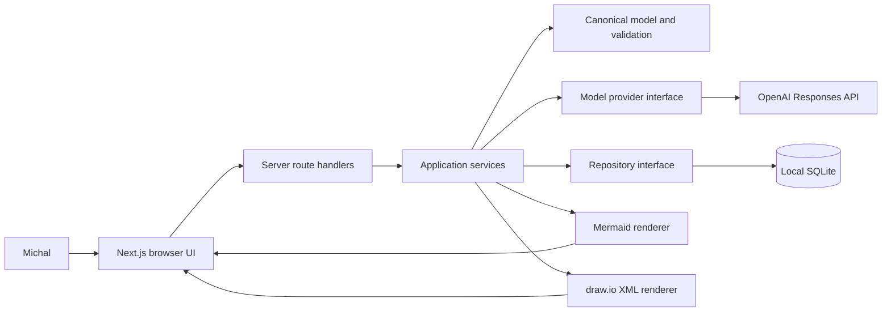
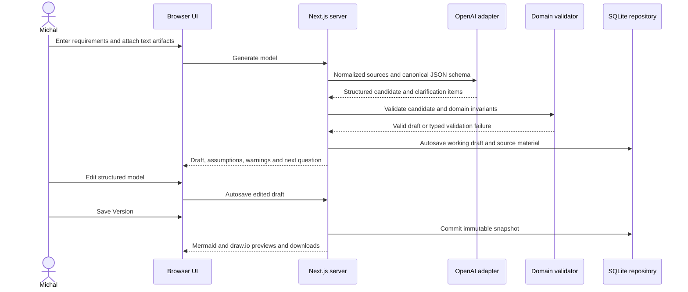

# Data-modelling agent design

## Context

Michal needs a single-user pilot for developing insurance data models from free-form
requirements and text-based technical artifacts. The application must turn uncertain
inputs into an explicit draft, preserve the supplied sources, provide structured editing,
and keep Mermaid and draw.io outputs semantically aligned. The pilot may handle sensitive
organisational information, sends supplied content to OpenAI when generation is requested,
and persists its state locally. It is not a production, multi-user or deployed service.

## Chosen approach

Build one TypeScript Next.js application using the App Router and the Node.js runtime.
Keep browser components concerned with intake, structured model editing and previews;
route handlers call application services through server-only boundaries.

The domain layer owns a validated canonical model. An input normalizer treats prose,
Markdown, DDL, SQL, JSON and schema files as inert text and creates a bounded generation
context. A replaceable model-provider interface uses the OpenAI Responses API in the real
adapter and a deterministic fake in tests. The provider is asked for structured JSON;
the application validates the response again before it can become a working draft.
`OPENAI_API_KEY` and `OPENAI_MODEL` are server environment settings, so no model choice or
credential is embedded in browser code or stored records.

Use Node's SQLite support behind a repository interface. One mutable working draft is
autosaved transactionally. An explicit Save Version action creates an immutable snapshot
of the request sources, canonical model and generated representations. Deterministic,
pure renderers derive Mermaid ER and draw.io XML from the same canonical model. The UI
provides structured entity, attribute, rule and relationship forms; canonical JSON is
read-only diagnostic output. Mermaid and draw.io previews are read-only, while downloads
contain the generated source formats.

## Alternatives considered

Generating Mermaid and draw.io independently from the model response was rejected because
the representations could disagree. Calling OpenAI from the browser was rejected because
it would expose credentials and weaken input control. A hosted database was rejected as
unnecessary for a local single-user pilot. Overwriting saved models was rejected because
it destroys review history. A raw JSON editor and an embedded draw.io editor were rejected
because structured domain editing gives one source of truth with a smaller pilot surface.

## Component diagram

## Data-flow diagram

## Domain model

`ModelProject` owns a title, timestamps, ordered `SourceArtifact` records, one
`WorkingDraft` and immutable `ModelVersion` records. A source artifact records its
original name, accepted text type, content and content length. A working draft records
the current canonical model, assumptions, warnings, clarification queue and generation
metadata. A version snapshots those values plus Mermaid and draw.io output.

`CanonicalModel` contains stable model, entity, attribute, relationship and rule IDs.
Entities contain names, business definitions, layout positions and attributes. Attributes
contain data type, optionality, primary-key and foreign-key metadata and business
definitions. Relationships reference existing entity IDs and express cardinality at both
ends. Validation rules have stable IDs, readable expressions and referenced domain IDs.

All relationship endpoints and referenced attributes must exist; names are unique within
their owner; keys cannot reference missing attributes; cardinality uses the supported
one/zero-or-one/many forms; and layout coordinates are finite. The Claim-Payment fixture
adds the explicit rule that total paid cannot exceed the approved claim amount. Ambiguous
facts remain assumptions, warnings or clarification items rather than invented domain
edges.

## Storage model

Use a project-local SQLite file excluded from Git. Versioned SQL migrations create four
tables: projects, source_artifacts, working_drafts and model_versions. Canonical models,
clarification state and generated representations are stored as validated JSON or text;
timestamps and version numbers are ordinary indexed columns. Foreign keys enforce project
ownership, and `(project_id, version_number)` is unique.

Autosave upserts the single working draft in one transaction without creating history.
Save Version reads the working draft, validates it, renders both formats and inserts one
immutable version plus its source snapshot in one transaction. Reopening an old version
does not mutate it; choosing to continue from it copies its canonical model into the
working draft. Repository interfaces keep SQLite details out of domain and UI code.

## External boundaries

Accept manually entered text plus `.md`, `.txt`, `.sql`, `.ddl` and `.json` files. Treat
every upload as inert UTF-8 text, enforce per-file and aggregate size limits, normalize
line endings, and reject binaries or malformed encodings. Never execute supplied DDL,
HTML or scripts.

Clicking Generate sends the normalized supplied material directly through the server-only
OpenAI adapter. The adapter uses the Responses API with a JSON Schema structured-output
contract, a configured model, bounded timeout and no application tools. The application
does not rely on provider output being valid: it parses and validates locally before
persistence. Tests replace the adapter and never make a network call.

SQLite is reachable only through the repository interface. Renderers are pure functions
over a validated canonical model. Download endpoints derive safe filenames, set explicit
content types and return only the requested representation.

## Security and privacy

The pilot has no authentication and therefore binds to the local development host by
default; it must not be exposed as a shared network service. The UI clearly states that
Generate sends the supplied material to OpenAI. Provider credentials and model settings
remain server-side environment variables and are never persisted, serialized into page
props or included in browser bundles.

Logs contain request IDs, durations and typed error categories, not source content,
prompts, provider responses or secrets. UI rendering escapes user-controlled text, and
generated XML uses an XML-safe encoder. SQLite and local source records are not encrypted
at rest in this pilot; filesystem access and backup protection remain host responsibilities.
Production use requires a new request/design covering authentication, authorization,
retention, encryption, approved provider settings and organisational data controls.

## Failure modes

Unsupported or oversized input is rejected before storage or provider access with a
specific correction message. Missing provider configuration disables live Generate while
leaving saved models usable. Provider timeout, rate limit or unavailable responses retain
the current working draft and offer an explicit retry without creating a version.

Malformed or schema-invalid model output is never stored as a canonical model; validation
details become a bounded error and may drive a new generation attempt. Domain ambiguity
produces a visible draft and one clarification question at a time. SQLite transaction
failure leaves the prior draft/version intact. Renderer failure blocks Save Version so a
version can never claim both representations when one is missing. Any newly discovered
material architecture or acceptance gap stops implementation for document revision and
human reacceptance.

## Verification strategy

Domain unit tests compare the canonical Claim-Payment fixture with literal expected
entities, attributes, keys, optionality, cardinality, definitions, layout and aggregate
rules. Input tests cover prose, Markdown, DDL, SQL, JSON, encoding, size limits and the
rule that DDL is never executed. Provider contract tests use a fake adapter for success,
ambiguity, invalid structure, timeout and missing configuration; a client-bundle check
guards against credential leakage.

Repository integration tests use a temporary SQLite database to prove source retention,
autosave, transactional immutable versions, list, reopen and continue-from-version.
Renderer tests parse Mermaid semantics and draw.io XML and compare both with the same
canonical fixture. Component tests exercise structured editing and read-only diagnostic
views. A browser test covers create, generate draft, answer clarification, edit, autosave,
save version, reopen, preview and download. The configured project unit and production
build commands run on the exact candidate. Final verification maps independent evidence
to every request criterion and to the complete intent without a live OpenAI call.

## Rollout and rollback

The pilot runs locally with a documented environment example and an empty SQLite database.
On first start, the application applies reviewed versioned migrations and refuses to run
against an unknown newer schema. Seed data is test-only; Michal creates the first real
project through the UI.

Before an incompatible migration, copy the SQLite file while the application is stopped
and verify that the copy opens. Prefer additive migrations during the pilot. Application
rollback may reuse the database only when its declared schema range includes the current
version; otherwise restore the matching backup. Disabling or removing OpenAI configuration
must leave saved versions readable. Deployment and production data migration remain out
of scope.

## Design decisions

| ID | Decision | Rationale | Alternatives | Consequences |
| --- | --- | --- | --- | --- |
| D-001 | Use one validated canonical model as the source of both outputs. | It makes semantic equivalence testable. | Generate each format independently. | Renderers need explicit mappings and shared fixtures. |
| D-002 | Keep all provider access behind a server-only interface. | Credentials and unvalidated responses must not enter browser code. | Call OpenAI from the browser. | Generation requires a running Node server. |
| D-003 | Use project-local SQLite behind a repository interface. | It is sufficient and portable for the single-user pilot. | Hosted SQL or browser storage. | The host owns file backup and access protection. |
| D-004 | Autosave one mutable draft and create immutable versions explicitly. | It combines editing safety with auditable history. | Autosave every edit as a version or overwrite history. | Draft and version lifecycle must be distinct. |
| D-005 | Make structured forms the primary editor and canonical JSON read-only. | Domain editing is safer than free-form JSON manipulation. | Editable JSON. | New domain fields require corresponding controls. |
| D-006 | Provide read-only Mermaid and draw.io previews. | The canonical editor remains the single editing surface. | Embed a draw.io editor. | External draw.io edits must be reintroduced manually. |
| D-007 | Send normalized source material on Generate without another confirmation gate. | This matches the accepted single-user workflow. | Add a pre-send review screen. | The UI must clearly disclose external transmission. |
| D-008 | Require structured provider output and validate it locally. | Provider formatting alone is not a trust boundary. | Accept prose or unchecked JSON. | Invalid responses fail closed and may require retry. |
| D-009 | Treat all uploaded artifacts as inert bounded UTF-8 text. | It supports the requested inputs without executing untrusted content. | Execute or deeply parse arbitrary DDL. | Initial semantic extraction depends on the model and validation. |
| D-010 | Bind the unauthenticated pilot locally and make no shared-service claim. | Single-user scope does not justify an authorization system. | Add authentication now. | Network deployment requires a new accepted design. |
| D-011 | Require the OpenAI model to be an environment setting. | Model choice can change without source edits. | Hard-code a model. | Startup must report missing configuration clearly. |
| D-012 | Store generated representations with each immutable version. | Reopened versions retain the exact reviewed outputs. | Regenerate every historical view. | Version storage is larger but deterministic review is simpler. |

## Approval

Status: accepted. Michal explicitly accepted design revision 1 for request revision 1
after the guided architecture review.
