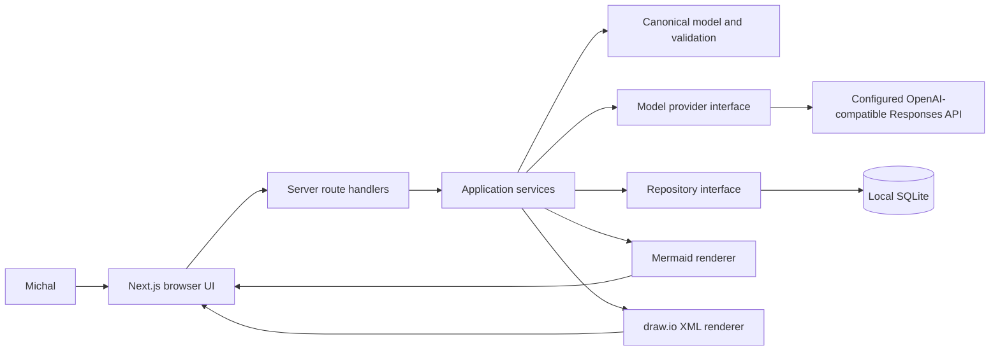
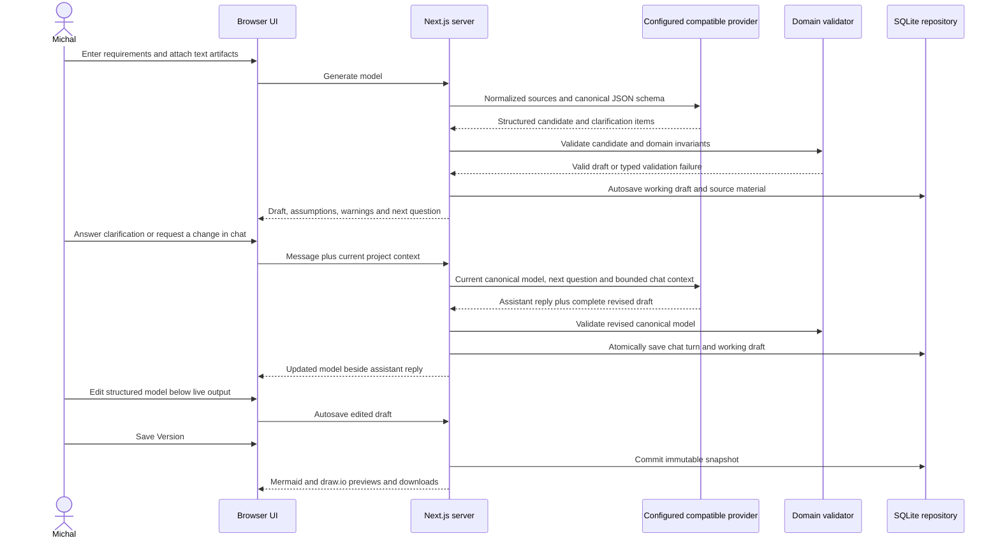

# Data-modelling agent design

## Context

Michal needs a single-user pilot for developing insurance data models from free-form
requirements and text-based technical artifacts. The application must turn uncertain
inputs into an explicit draft, preserve the supplied sources, provide structured editing,
and keep Mermaid and draw.io outputs semantically aligned. The pilot may handle sensitive
organisational information, sends supplied content to OpenAI when generation is requested,
and persists its state locally. It is not a production, multi-user or deployed service.

## Chosen approach

Build one TypeScript Next.js application using the App Router and the Node.js runtime.
Keep browser components concerned with intake, structured model editing and previews;
route handlers call application services through server-only boundaries.

The domain layer owns a validated canonical model. An input normalizer treats prose,
Markdown, DDL, SQL, JSON and schema files as inert text and creates a bounded generation
context. A replaceable model-provider interface uses the OpenAI Responses API in the real
adapter and a deterministic fake in tests. The provider is asked for structured JSON;
the application validates the response again before it can become a working draft.
`OPENAI_API_KEY` remains a server environment secret. A Settings view lets Michal choose
the non-secret base URL and model for an OpenAI-compatible Responses API; those values are
validated at the server boundary and stored locally so provider choice does not require a
source edit or expose the credential to browser code.

Use Node's SQLite support behind a repository interface. One mutable working draft is
autosaved transactionally. An explicit Save Version action creates an immutable snapshot
of the request sources, canonical model and generated representations. Deterministic,
pure renderers derive Mermaid ER and draw.io XML from the same canonical model. The UI
provides structured entity, attribute, rule and relationship forms; canonical JSON is
read-only diagnostic output. Mermaid and draw.io previews are read-only, while downloads
contain the generated source formats.

A model project exists independently of provider generation. Michal can save, reopen and
edit its name, requirements and source artifacts before any draft exists, then generate
when the intake is ready. Deleting a project is an explicit confirmed action that removes
the project and its cascading source, working-draft and version records; cancellation
must leave all records unchanged.

After a working draft exists, a project-scoped chat shares the top of the workbench with
the live model output. Each user message is sent with the current canonical model, the
next unresolved clarification when one exists, and bounded recent conversation context.
Clarifications are ordinary guided chat turns rather than a separate form: answering the
question asks the provider to update the model and advance or clear the clarification
queue. The provider returns both a concise assistant reply and a complete proposed
canonical draft under structured output; local validation must pass before the draft and
both chat messages are saved together. The structured editor remains the authoritative,
directly editable view below the collaboration row, so conversational changes are
immediately visible in the model output and editor.

Use the project-local UI/UX Pro Max output in
`design-system/data-model-agent/MASTER.md` as the visual interaction contract. Present the
application as a calm, data-dense enterprise workbench rather than a marketing page. A
compact product header exposes local-pilot and save state. Its Model Foundry brand returns
to the home intake and is labelled as the Data Model Design Space. Desktop places live model
output and project chat side by side at the top, followed by the full-width structured
editor and history; assumptions and warnings form the final review section. Smaller
screens stack those regions in the same reading order without horizontal page scroll.
The saved-model workspace is a keyboard-operable collapsible sidebar: collapsing it leaves
an icon rail and gives the workbench and live output the recovered width. Settings is a
first-class sidebar destination rather than a hidden environment-only task.
Entity details use accessible progressive
disclosure so a large model remains scannable, while relationships, rules, preview,
downloads and version history remain discoverable. Semantic colors, persistent labels,
native controls, visible focus, live status and reduced-motion behavior are required.
All buttons share one font family, weight, sizing rhythm, radius and focus treatment;
semantic variants change color without changing their typographic character. Both model
representations use one interactive canvas: a mouse wheel zooms around the pointer,
primary mouse-button dragging pans the model, and visible zoom/reset controls plus
focusable arrow and zoom keys provide non-drag alternatives. Switching representation
resets the viewport so an off-screen pan cannot make the next model appear empty.
The canvas defaults and resets to 50% scale, can zoom out further for large models, and is
taller on desktop. Chat messages must shrink within their panel and wrap long tokens rather
than expanding the collaboration grid or creating horizontal overflow.

## Alternatives considered

Generating Mermaid and draw.io independently from the model response was rejected because
the representations could disagree. Calling OpenAI from the browser was rejected because
it would expose credentials and weaken input control. A hosted database was rejected as
unnecessary for a local single-user pilot. Overwriting saved models was rejected because
it destroys review history. A raw JSON editor and an embedded draw.io editor were rejected
because structured domain editing gives one source of truth with a smaller pilot surface.

## Component diagram

## Data-flow diagram

## Domain model

`ModelProject` owns a title, timestamps, ordered `SourceArtifact` records, one
`WorkingDraft` and immutable `ModelVersion` records. A source artifact records its
original name, accepted text type, content and content length. A working draft records
the current canonical model, assumptions, warnings, clarification queue and generation
metadata. A version snapshots those values plus Mermaid and draw.io output.

`CanonicalModel` contains stable model, entity, attribute, relationship and rule IDs.
Entities contain names, business definitions, layout positions and attributes. Attributes
contain data type, optionality, primary-key and foreign-key metadata and business
definitions. Relationships reference existing entity IDs and express cardinality at both
ends. Validation rules have stable IDs, readable expressions and referenced domain IDs.

All relationship endpoints and referenced attributes must exist; names are unique within
their owner; keys cannot reference missing attributes; cardinality uses the supported
one/zero-or-one/many forms; and layout coordinates are finite. The Claim-Payment fixture
adds the explicit rule that total paid cannot exceed the approved claim amount. Ambiguous
facts remain assumptions, warnings or clarification items rather than invented domain
edges.

## Storage model

Use a project-local SQLite file excluded from Git. Versioned SQL migrations create six
tables: projects, source_artifacts, working_drafts, model_messages, model_versions and
provider_settings. Canonical models, clarification state and generated representations are stored as validated JSON or text;
timestamps and version numbers are ordinary indexed columns. Foreign keys enforce project
ownership, and `(project_id, version_number)` is unique.

Autosave upserts the single working draft in one transaction without creating history.
Save Version reads the working draft, validates it, renders both formats and inserts one
immutable version plus its source snapshot in one transaction. Reopening an old version
does not mutate it; choosing to continue from it copies its canonical model into the
working draft. Repository interfaces keep SQLite details out of domain and UI code.
Project chat messages use ordered user/assistant roles and cascade with project deletion.
A successful chat turn writes its two messages and revised working draft in one
transaction; provider or validation failure writes neither.

A singleton `provider_settings` row stores only the normalized OpenAI-compatible base URL,
model name and update timestamp. Environment values supply the initial fallback until the
user saves settings. The API key is never part of that row. Updating provider settings is
an idempotent upsert and does not modify projects, drafts, messages or versions.

## External boundaries

Accept manually entered text plus `.md`, `.txt`, `.sql`, `.ddl` and `.json` files. Treat
every upload as inert UTF-8 text, enforce per-file and aggregate size limits, normalize
line endings, and reject binaries or malformed encodings. Never execute supplied DDL,
HTML or scripts.

Clicking Generate sends the normalized supplied material directly through the server-only
OpenAI-compatible adapter. The adapter appends `/responses` to the validated configured
base URL and uses a JSON Schema structured-output contract, configured model, bounded
timeout and no application tools. Base URLs must use HTTP or HTTPS, contain no embedded
credentials and remain length bounded. Provider runtime settings are server-only
environment values: `OPENAI_TIMEOUT_MS` defaults to 120 seconds,
`OPENAI_REASONING_EFFORT` defaults to `low`, and `OPENAI_MAX_OUTPUT_TOKENS` defaults to
8,000. Invalid settings fail closed before a request. The application does not rely on
provider output being valid: it parses and validates locally before persistence. Tests
replace the adapter and never make a network call.

Chat uses a separate structured-output contract over the same provider boundary. It sends
the current requirements, canonical model, bounded source context, next unresolved
clarification, a bounded recent chat history and the new message. When the message answers
that clarification, the complete result must apply the answer to the model and advance or
clear the clarification queue. A chat response must contain a non-empty assistant reply
and a complete generation result; partial patches are not applied to the canonical model.

SQLite is reachable only through the repository interface. Renderers are pure functions
over a validated canonical model. Download endpoints derive safe filenames, set explicit
content types and return only the requested representation.

## Security and privacy

The pilot has no authentication and therefore binds to the local development host by
default; it must not be exposed as a shared network service. The UI clearly states that
Generate and chat send the supplied material to the configured provider. The API key
remains a server-side environment variable and is never persisted, serialized into page
props or included in browser bundles. The non-secret base URL and model are visible and
editable in Settings; changing them affects the next provider request and never migrates
or retransmits stored model data by itself.

Logs contain request IDs, durations and typed error categories, not source content,
prompts, provider responses or secrets. Provider diagnostics record the configured model
and non-sensitive runtime settings so a timeout, rate limit, provider rejection or
incomplete capped response remains distinguishable. UI rendering escapes user-controlled
text, and generated XML uses an XML-safe encoder. SQLite and local source records are not
encrypted at rest in this pilot; filesystem access and backup protection remain host responsibilities.
Chat content is subject to the same local-storage and provider-transmission disclosure as
requirements and source files. User messages are length-bounded server-side, rendered as
text, and never interpolated into executable code.
Production use requires a new request/design covering authentication, authorization,
retention, encryption, approved provider settings and organisational data controls.

## Failure modes

Unsupported or oversized input is rejected before storage or provider access with a
specific correction message. Missing provider configuration disables live Generate while
leaving saved models usable. Provider timeout, rate limit or unavailable responses retain
the current working draft and offer an explicit retry without creating a version. A
response stopped by the configured output-token cap is reported as incomplete rather than
streaming or background generation is deferred until representative timings show that the
interactive request still needs a longer-running job boundary.
An invalid provider base URL or blank model is rejected inline without changing the saved
settings. A configured endpoint that does not support the expected Responses API fails as
a typed provider error while saved work remains available. The same typed provider
failures apply to chat. A failed, incomplete or invalid chat
response leaves both the current draft and transcript unchanged, making retry explicit.

Malformed or schema-invalid model output is never stored as a canonical model; validation
details become a bounded error and may drive a new generation attempt. Domain ambiguity
produces a visible draft and one clarification question at a time inside the chat
workflow. SQLite transaction
failure leaves the prior draft/version intact. Renderer failure blocks Save Version so a
version can never claim both representations when one is missing. Any newly discovered
material architecture or acceptance gap stops implementation for document revision and
human reacceptance.

## Verification strategy

Domain unit tests compare the canonical Claim-Payment fixture with literal expected
entities, attributes, keys, optionality, cardinality, definitions, layout and aggregate
rules. Input tests cover prose, Markdown, DDL, SQL, JSON, encoding, size limits and the
rule that DDL is never executed. Provider contract tests use a fake adapter for generation
and chat success, ambiguity, invalid structure, timeout, incomplete output, safe
diagnostics, configured base URL/model selection and missing or invalid configuration; a
client-bundle check guards against credential leakage.

Repository integration tests use a temporary SQLite database to prove source retention,
pre-generation update and delete, atomic chat-turn persistence, autosave, transactional
immutable versions, list, reopen and continue-from-version.
Renderer tests parse Mermaid semantics and draw.io XML and compare both with the same
canonical fixture. Component tests exercise structured editing, read-only diagnostic
views, settings, collapsible navigation, chat wrapping and the accessible zoom controls.
A browser test covers create, generate draft,
mouse-wheel zoom, drag pan, keyboard/reset alternatives, answer clarification, edit,
autosave, save version, reopen, preview and download. The configured project unit and
production build commands run on the exact candidate. Final verification maps independent
evidence to every request criterion and to the complete intent without a live OpenAI call.

## Rollout and rollback

The pilot runs locally with a documented environment example and an empty SQLite database.
On first start, the application applies reviewed versioned migrations and refuses to run
against an unknown newer schema. Seed data is test-only; Michal creates the first real
project through the UI.

Before an incompatible migration, copy the SQLite file while the application is stopped
and verify that the copy opens. Prefer additive migrations during the pilot. Application
rollback may reuse the database only when its declared schema range includes the current
version; otherwise restore the matching backup. Disabling or removing OpenAI configuration
must leave saved versions readable. Deployment and production data migration remain out
of scope.

## Design decisions

| ID | Decision | Rationale | Alternatives | Consequences |
| --- | --- | --- | --- | --- |
| D-001 | Use one validated canonical model as the source of both outputs. | It makes semantic equivalence testable. | Generate each format independently. | Renderers need explicit mappings and shared fixtures. |
| D-002 | Keep all provider access behind a server-only interface. | Credentials and unvalidated responses must not enter browser code. | Call OpenAI from the browser. | Generation requires a running Node server. |
| D-003 | Use project-local SQLite behind a repository interface. | It is sufficient and portable for the single-user pilot. | Hosted SQL or browser storage. | The host owns file backup and access protection. |
| D-004 | Autosave one mutable draft and create immutable versions explicitly. | It combines editing safety with auditable history. | Autosave every edit as a version or overwrite history. | Draft and version lifecycle must be distinct. |
| D-005 | Make structured forms the primary editor and canonical JSON read-only. | Domain editing is safer than free-form JSON manipulation. | Editable JSON. | New domain fields require corresponding controls. |
| D-006 | Provide read-only Mermaid and draw.io previews. | The canonical editor remains the single editing surface. | Embed a draw.io editor. | External draw.io edits must be reintroduced manually. |
| D-007 | Send normalized source material on Generate without another confirmation gate. | This matches the accepted single-user workflow. | Add a pre-send review screen. | The UI must clearly disclose external transmission. |
| D-008 | Require structured provider output and validate it locally. | Provider formatting alone is not a trust boundary. | Accept prose or unchecked JSON. | Invalid responses fail closed and may require retry. |
| D-009 | Treat all uploaded artifacts as inert bounded UTF-8 text. | It supports the requested inputs without executing untrusted content. | Execute or deeply parse arbitrary DDL. | Initial semantic extraction depends on the model and validation. |
| D-010 | Bind the unauthenticated pilot locally and make no shared-service claim. | Single-user scope does not justify an authorization system. | Add authentication now. | Network deployment requires a new accepted design. |
| D-011 | Use the environment model as the initial server-side default. | Model choice starts configurable without being embedded in source. | Hard-code a model. | A saved D-019 setting supersedes the default, and missing effective configuration is reported clearly. |
| D-012 | Store generated representations with each immutable version. | Reopened versions retain the exact reviewed outputs. | Regenerate every historical view. | Version storage is larger but deterministic review is simpler. |
| D-013 | Use a responsive three-zone enterprise workbench with progressive entity disclosure and a persistent preview rail. | It keeps dense modelling tasks scannable and puts model feedback beside the edit that causes it. | Marketing hero with a single long form; separate editor and preview pages. | The layout stacks at narrower widths and UI tests must cover disclosure, focus, feedback and responsive behavior. |
| D-014 | Make synchronous OpenAI generation bounds configurable, defaulting to a 120-second timeout, low reasoning effort and 8,000 generated tokens, with typed non-sensitive diagnostics. | The original fixed 45-second deadline aborted valid `gpt-5.6-sol` structured-output work while connectivity and model access were healthy. | Keep the fixed deadline; immediately adopt streaming/background jobs; hard-code a faster model. | Operators can tune latency without source edits; capped incomplete responses fail explicitly; streaming remains a later measured improvement. |
| D-015 | Treat project intake as a saved lifecycle stage before provider generation, with editable inputs and confirmed project deletion. | A provider failure must not trap a saved project in a read-only retry screen, and users need to prepare work without making a provider call. | Create projects only as a side effect of Generate; require database cleanup for abandoned projects. | The API supports update and delete, deletes cascade transactionally, and the UI distinguishes Save model from Generate draft. |
| D-016 | Keep a persistent project chat beside the structured model editor and apply only complete, validated LLM revisions. | Users need a conversational way to evolve a built model while seeing the resulting source of truth. | Hide chat on a separate page; apply unvalidated JSON patches; keep chat ephemeral. | Chat turns and revised drafts commit atomically, recent context is bounded, and responsive layouts stack the same two surfaces on narrow screens. |
| D-017 | Make live output and chat the top collaboration row, handle clarification as a chat workflow, place the structured editor below, and leave assumptions and warnings until the bottom review section. | The user should see the model change beside the conversation driving it, while detailed editing and residual review information follow the main task flow. | Keep a separate clarification form; lead with assumptions and warnings; retain the editor-plus-preview-rail layout. | Chat requests include the pending question, successful answers update the complete validated draft, keyboard order follows visual order, and narrow screens stack output, chat, editor, history and review in that sequence. All buttons use one typographic and sizing system. |
| D-018 | Wrap Mermaid and draw.io in one bounded interactive canvas with pointer-centred wheel zoom, drag panning, visible zoom/reset buttons and keyboard equivalents. | Large insurance models must remain inspectable without page-level overflow, while dragging cannot be the only way to navigate. | Keep scrollbars only; add interaction to just one representation; depend on a diagramming library. | Both formats share identical viewport behavior, scale is bounded, mode changes reset the view, controls have accessible names, and browser tests exercise real mouse and keyboard input. |
| D-019 | Persist a validated non-secret base URL and model for an OpenAI-compatible Responses API while keeping the API key environment-only. | Selecting another compatible provider must not require source edits or put credentials in the browser/database. | Keep all settings environment-only; store API keys in SQLite; implement multiple provider-specific adapters now. | Settings affect subsequent requests, use an idempotent singleton row, clearly disclose the configured destination, and reject invalid URLs/models without overwriting the last valid values. |
| D-020 | Use a collapsible workspace navigation rail, make the brand a home action, enlarge the visualization, reset it to 50%, and constrain chat content to the panel. | The model is the primary work surface and should gain space without sacrificing discoverable navigation or readable conversation. | Keep the permanent 240px panel; hide navigation entirely; add a separate route for every view. | Desktop collapse state remains local UI state with labelled icon controls, narrow screens keep a full-width menu, the live-output column receives the recovered width, and long user/provider content wraps without page overflow. |

## Approval

Status: accepted. Michal explicitly accepted design revision 1 for request revision 1
after the guided architecture review, then directly authorized applying the installed
UI/UX design skill to redesign the pilot workbench. That instruction accepts revision 2's
visual and interaction decision without changing request intent or acceptance criteria.
After two observed 45-second provider aborts, Michal explicitly approved the proposed
configurable provider bounds, low reasoning and diagnostic fix. That decision accepts
revision 3 and D-014 without changing request intent or acceptance criteria.
Michal then explicitly required models to remain editable and deletable before generation.
That direct feature decision accepts revision 4 and D-015; it advances the lifecycle
design without changing the accepted modelling intent.
Michal then explicitly required a chat UI beside the built model so users can ask the LLM
to update it. That direct feature decision accepts revision 5 and D-016. Persisting the
project-scoped transcript and applying only complete validated revisions are the safety
and continuity consequences of that interaction requirement.
Michal then explicitly placed live output and chat together at the top, moved the
structured editor below them, moved assumptions and warnings to the bottom, and made the
next clarification part of chat. The same request requires a polished interface and a
consistent button type system. That direct interaction decision accepts revision 6 and
D-017 without changing the modelling intent or provider trust boundary.
Michal then explicitly required the model visualisation to zoom and move with a mouse.
That direct interaction decision accepts revision 7 and D-018. Accessible buttons and
keyboard navigation are required alternatives to the mouse gestures and do not expand
the modelling or provider scope.
Michal then explicitly required selectable provider base-URL settings, a settings panel,
a collapsible workspace menu, a larger 50%-default canvas, bounded chat messages and a
clickable home brand labelled Data Model Design Space. That direct feature decision
accepts revision 8 with D-019 and D-020. The API key remains server-only, and compatibility
is limited to providers implementing the expected OpenAI Responses API contract.
